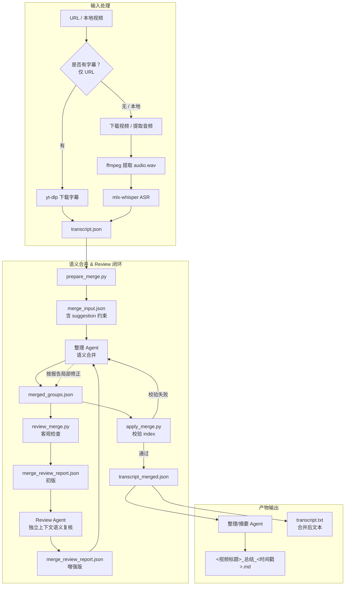
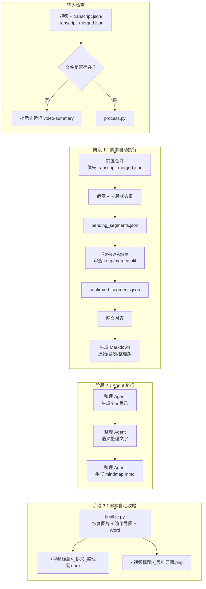

# video-to-slides

视频截图 → 图文讲义。本 Skill 假设已有视频文件和转录文本；如果缺少则提示用户先运行 `video-summary`。

---

## 环境前置

- **网络访问**：下载视频、获取字幕需网络访问权，沙箱内 DNS 不可用时需提权运行
- **ASR 转录**：mlx-whisper 需 Apple Silicon Metal GPU，沙箱内不可用；可用 `--transcript` 复用已有转录跳过 ASR
- **ffmpeg**：截图、音频提取依赖 ffmpeg（`brew install ffmpeg`）
- **doctor 命令**：Metal 不可用时优雅降级报告，不再崩溃

---

## 工作流总览（三步中断式）

```
capture → review-segments(agent 介入) → finalize（仅 Markdown） → render_mindmap（导图 + Word）
```

### capture：时长密度截图 + 分段草案
- 根据视频时长动态决定截图间隔（≤5min→15s，≤15min→20s，≤30min→30s，>30min→40s）
- 候选图封顶约 120 张
- 生成分段草案 pending_segments.json

### review-segments：agent 介入分段
- agent 审查 pending_segments.json，修改 suggested_action（keep/merge/split）
- 确认后写 confirmed_segments.json

### finalize：每段选 1 张最佳截图 + 补图 + 产物
- 每段选 edge_density 最高的候选图作为该段唯一截图
- slide 时间范围设为段的 [start_ms, end_ms]，使 align_sections 将段内所有 transcript 文字归到这一页
- 无候选图的段在段中点补一帧
- merge 段时间范围自动扩展到目标段
- 跨段边界去重（仅相邻段）
- 生成 Markdown（Word 与思维导图在 Agent 整理后由 render_mindmap.py 生成）

---

## 完整工作流图示

### 前置 Skill：video-summary 工作流



### 本 Skill：video-to-slides 工作流



---

## 阶段 1：脚本自动执行

> **Agent 注意**：以下步骤由脚本自动完成，你不需要干预。

### ① 前置检查

- 确认视频文件、`transcript.json` 是否存在
- 缺少时提示用户先运行 `video-summary`

### ①.5 前置合并（复用 video-summary 转录时）

当通过 `--transcript` 复用 video-summary 产出的 `transcript.json` 时，若碎段很多（半句话一段，
通常 ASR 产出数百段），直接用于图文对齐会导致每页只有半句话、页数碎片化。此时应**先执行
video-summary 的 ⑤.5 语义合并步骤**：

1. `prepare_merge`：读取 `transcript.json` 生成 `merge_input.json`（含目标段数建议）
2. Agent 按 ⑤.5 合并规则写 `merged_groups.json`（同话题聚合，原文保留只加标点）
3. `apply_merge` 校验并落盘，产出 `transcript_merged.json`（约数十段）

pipeline 会**自动优先使用同目录的 `transcript_merged.json`**（若存在），无需额外参数；
若未做合并，则回退使用原始 `transcript.json`。

### ② 截图 + 三段式去重

- 运行 `scripts/process.py`，默认 `--capture-mode audit --fallback-interval-sec 15`（OCR 去重默认开启，无需显式传；用 `--no-ocr-dedupe` 关闭）
- 三段式去重：明显重复 → 合并；明显不同 → 保留；不确定 → OCR 判定

### ③ 图文对齐

- 按毫秒级时间轴将截图页与转录片段匹配

### ④ 生成 Markdown

脚本自动生成三份 Markdown：

| 文件 | 说明 |
|------|------|
| `<视频标题>_讲义_<时间戳>.md` | 原始换行版 |
| `<视频标题>_讲义_紧凑版_<时间戳>.md` | 紧凑段落版 |
| `<视频标题>_讲义_整理版_<时间戳>.md` | **Agent 工作文件**（含 `<!-- IMAGE:N -->` 占位符） |

> **注意**：此阶段**仅输出 Markdown**，`.docx` 和 `.png` 尚未生成。Agent 完成整理并手写 `mindmap.mmd` 后，需运行 `render_mindmap.py` 生成最终导图与 Word。

---

## 阶段 2：Agent 执行（核心任务）

> **Agent 注意**：以下步骤需要你手动完成。

### ⑤ 生成全文目录（**必做，不可跳过**）

> **Agent 注意**：本步骤是**整个流程中唯一**生成目录的步骤，目录**只写一次**到**紧凑版**；⑥ 步会把它复制到整理版。

**输入**：`<视频标题>_讲义_紧凑版_<时间戳>.md`

**任务**：
1. 阅读紧凑版全文，识别章节划分
2. 在 `## 图文讲义` 标题之后、`### 第 1 页` 之前插入目录

**输出格式**：
```markdown
## 图文讲义

- **第一章 章节名称**（00:00 - 05:30）：简短概述
- **第二章 章节名称**（05:30 - 10:15）：简短概述

---

### 第 1 页 · 00:00 - 00:30
```

**要求**：
- 章节划分依据语义转折，不是按页数均分
- 时间范围精确到秒
- **必须**包含至少 3 个章节项；少于 3 个说明章节切分太粗

---

### ⑥ 语义整理（**必做，不可跳过**）

> **Agent 注意**：本步骤包括**复制目录**和**改写文字**两个任务，**两个都必做**。

**输入**：
- `<视频标题>_讲义_整理版_<时间戳>.md`（占位版：每页只有 `<!-- IMAGE:N -->` + 原始 ASR）
- `<视频标题>_讲义_紧凑版_<时间戳>.md`（⑤ 步已写入目录）

**任务**：

#### 任务 1：从紧凑版复制目录到整理版（**先做**）
1. 读紧凑版 `## 图文讲义` 标题后、`### 第 1 页` 之前的内容（即 ⑤ 步写入的目录 + 分隔线）
2. 在整理版的 `## 图文讲义` 标题后（**已有标题，不要再加**）、`### 第 1 页` 之前**插入这段内容**

#### 任务 2：改写每页文字
1. **只改写文字内容**，不要动 `<!-- IMAGE:N -->` 占位符
2. 不新增视频里没有的事实
3. 去掉口播冗余（"好"、"嗯"、"那个"等）
4. 将口语化表达改写为书面语
5. 保留页码和时间信息

**输出**：改写后的 `<视频标题>_讲义_整理版_<时间戳>.md`，**应有 `## 图文讲义` 标题 + 完整目录 + `---` + 各页整理后文字 + 图片占位符**

> ⑥ 步做完后，**不要**单独跑 `restore_images.py`——阶段 3 收尾由 `finalize.py` wrapper 统一处理（见 ⑩ 步）。

---

### ⑦ 重写思维导图

**输入**：改写后的 `<视频标题>_讲义_整理版_<时间戳>.md`

**任务**：
1. 基于书面整理版提取核心观点
2. 重写 `<视频标题>_思维导图_<时间戳>.mmd`
3. 格式为 Mermaid mindmap

**输出**：`<视频标题>_思维导图_<时间戳>.mmd`

---

## 阶段 3：脚本自动收尾

> **Agent 注意**：以下步骤由 `finalize.py` **统一脚本**完成，你不需要分别跑多个命令。

### ⑩ 收尾：图片恢复 + 思维导图 + Word

- 运行 `python3 .agents/skills/video-to-slides/scripts/finalize.py <run_dir>`：
  - 自动恢复图片（`restore_images.py`）
  - 自动渲染思维导图（`render_mindmap.py`）
  - 自动生成/刷新紧凑版、整理版两份 Word
- 当节点过多或单图尺寸过大时，自动按章节拆分 `mindmap_01.png`、`mindmap_02.png`... 并同步插入 Markdown/Word
- **此步骤是 agent 唯一需要手动运行的脚本命令**（阶段 1 入口 `process.py` 除外）

---

## 默认命令

```bash
# 标准流程（需要已有视频和转录）
# 注意：video-summary 下载的视频文件名是 <视频标题>.mp4，不是 video.mp4
python3 .agents/skills/video-to-slides/scripts/process.py "/path/to/<视频标题>.mp4"

# 指定已有转录（推荐：从 video-summary 产物直接引用）
# 强烈建议同时传 --run-dir，让产物继续落在 video-summary 的目录里，避免产生第二个文件夹。
python3 .agents/skills/video-to-slides/scripts/process.py \
  "runs/<视频标题>_<时间戳>/<视频标题>.mp4" \
  --transcript "runs/<视频标题>_<时间戳>/transcript.json" \
  --run-dir "runs/<视频标题>_<时间戳>"

# 手工修改思维导图后刷新
python3 .agents/skills/video-to-slides/scripts/render_mindmap.py runs/<视频标题>_<时间戳>
```

---

## 参数说明

| 参数 | 默认值 | 说明 |
|------|--------|------|
| `video` | （必填） | 视频文件路径 |
| `--project-dir` | 自动检测 | VideoToDoc 项目根目录 |
| `--asr` | `mlx-whisper` | ASR 后端 |
| `--transcript` | `None` | 已有转录文件路径（跳过 ASR） |
| `--capture-mode` | `audit` | 截图模式：fast/fine/audit |
| `--fallback-interval-sec` | `15` | 兜底截图间隔秒数 |
| `--no-ocr-dedupe` | 关闭 | 关闭 OCR 辅助去重（默认开启） |
| `--sync-offset-ms` | `None` | 时间偏移修正（毫秒） |
| `--force-rebuild` | `[]` | 重跑步骤：audio/asr/slides/align/mindmap |

---

## 截图去重规则

1. **明显重复**：`change_ratio < 0.005` 且 `dHash <= 8` → 合并，保留后一张
2. **明显不同**：`change_ratio >= 0.12` 或 `dHash > 16` → 保留新页
3. **不确定**：调用 OCR；文本相似度 `>= 0.92` 且变化面积 `< 0.12` → 重复，否则保留

不要对全部候选图全量 OCR。白底 PPT 容易误合并，OCR 去重默认开启；如需关闭用 `--no-ocr-dedupe`。

---

## Word 样式规范

- **文章标题**：黑色大标题，居中
- **页码行**：蓝色页码 + 灰色时间
- **正文**：10.5-11pt，1.15 倍行距，段前 0，段后 0.5 行
- **分隔线**：每页之间水平分隔线
- **思维导图**：文档末尾

---

## 产物结构

```
runs/<视频标题>_<时间戳>/
├── <视频标题>_讲义_<时间戳>.md              # 原始换行版
├── <视频标题>_讲义_紧凑版_<时间戳>.md       # 紧凑段落版
├── <视频标题>_讲义_整理版_<时间戳>.md       # 书面整理版
├── <视频标题>_讲义_<时间戳>.docx           # 原文 Word
├── <视频标题>_讲义_整理版_<时间戳>.docx     # 整理版 Word
├── <视频标题>_思维导图_<时间戳>.mmd         # Mermaid 导图源文件
├── <视频标题>_思维导图_<时间戳>.png         # 渲染后的导图（单张）
├── <视频标题>_质量报告_<时间戳>.md          # 质量报告
└── selected_slides_<模式>_<参数>/          # 最终截图
```

---

## 与其他 Skill 的关系

- **video-summary**：前置 Skill。缺少视频/音频/字幕时，引导用户先运行它。
- **feishu-markdown-publish**：后续 Skill。生成 Word 后，如需发布飞书使用它。

---

## 注意事项

1. 不要默认用 5 秒截图间隔，默认 15 秒
2. 不要只用 dHash 判断白底 PPT，容易误合并
3. 不要把 key 写进 Skill；飞书依赖本机 lark-cli
4. 不批量删除文件或目录；产物保留在 `runs/` 下
5. 复用 `video-summary` 的产物时，建议显式传 `--run-dir`；若视频路径位于 `runs/<标题>_<时间戳>/` 下，脚本会自动推断并复用该目录
