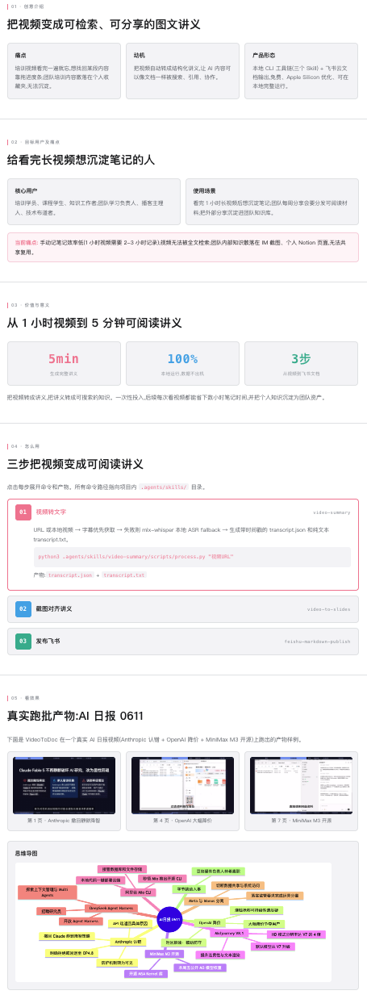

# VideoToDoc

VideoToDoc 是一个面向课程、讲座、培训视频的本地工作流：提取音频、用 Apple Silicon 友好的 `mlx-whisper` 转录文字，自动截取 PPT/讲义页面，把截图和讲稿对齐，生成 Word、Markdown、Mermaid 思维导图。

项目提供 Claude Code Skill 源文件，让 Agent 可以通过自然语言触发完整流程。

---

## 🎓 项目概览



### 三步把任意视频变成团队知识

```bash
# 1. 视频转文字(URL 或本地路径,字幕优先,无字幕走 mlx-whisper)
python3 .agents/skills/video-summary/scripts/process.py "<视频URL>"

# 2. 视频 + transcript → 截图去重 + 图文对齐 + Markdown/Word/思维导图
python3 .agents/skills/video-to-slides/scripts/process.py video.mp4 \
  --transcript transcript.json

# 3. Markdown 讲义 → 飞书云文档(逐页 + 图片 + 分隔线)
python3 .agents/skills/feishu-markdown-publish/scripts/publish.py 讲义.md
```

---

## 目录结构

```text
.agents/skills/
├── _shared/
│   └── project.py          # 项目目录定位工具
├── video-summary/
│   ├── SKILL.md            # Skill 定义
│   ├── README.md           # 使用说明
│   └── scripts/
│       └── process.py      # 视频下载 + ASR + 摘要
├── video-to-slides/
│   ├── SKILL.md
│   ├── README.md
│   └── scripts/
│       ├── process.py      # 截图 + 图文对齐 + Word 生成
│       ├── render_mindmap.py  # 思维导图渲染
│       ├── restore_images.py  # 语义整理后恢复图片
│       └── videotodoc/     # 核心实现(可独立运行)
│           ├── cli.py
│           ├── align.py
│           ├── document.py
│           ├── mindmap.py
│           └── ...
└── feishu-markdown-publish/
    ├── SKILL.md
    ├── README.md
    └── scripts/
        └── publish_markdown.py  # 飞书文档发布
```

## 安装依赖

```bash
pip install mlx-whisper python-docx Pillow curl_cffi yt-dlp
```

## 使用

### 1. 视频总结

```bash
python3 .agents/skills/video-summary/scripts/process.py "<视频URL>"
```

### 2. 视频转图文讲义

```bash
python3 .agents/skills/video-to-slides/scripts/process.py \
  "runs/<视频标题>_<时间戳>/<视频标题>.mp4" \
  --transcript "runs/<视频标题>_<时间戳>/transcript.json"
```

### 3. 渲染思维导图

```bash
python3 .agents/skills/video-to-slides/scripts/render_mindmap.py "<run目录>"
```

## 产物结构

```text
runs/<视频标题>_<时间戳>/
├── <视频标题>_讲义_<时间戳>.md
├── <视频标题>_讲义_紧凑版_<时间戳>.md
├── <视频标题>_讲义_整理版_<时间戳>.md
├── <视频标题>_讲义_<时间戳>.docx
├── <视频标题>_讲义_整理版_<时间戳>.docx
├── <视频标题>_思维导图_<时间戳>.mmd
├── <视频标题>_思维导图_<时间戳>.png
├── <视频标题>_质量报告_<时间戳>.md
└── selected_slides_<模式>_<参数>/
    └── 0001.png ...
```
