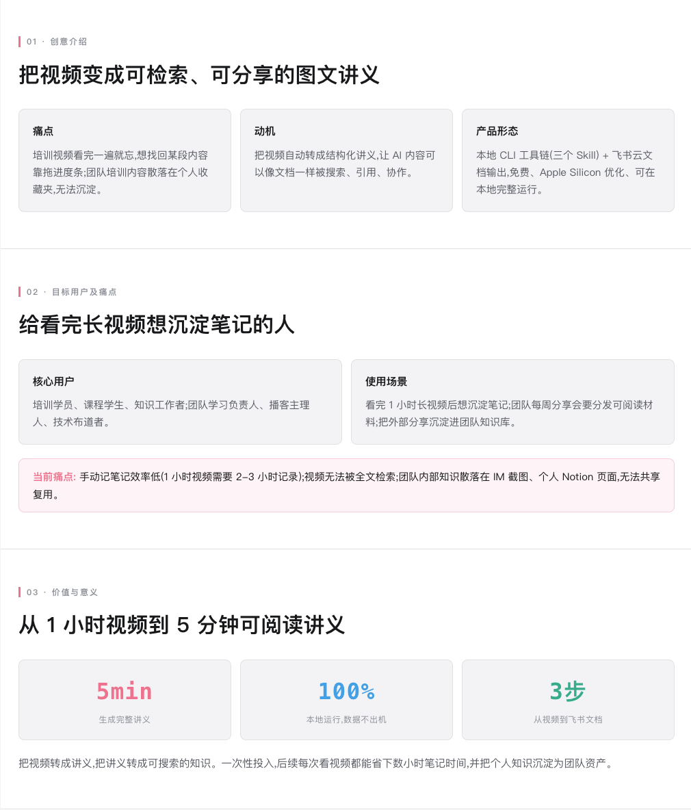
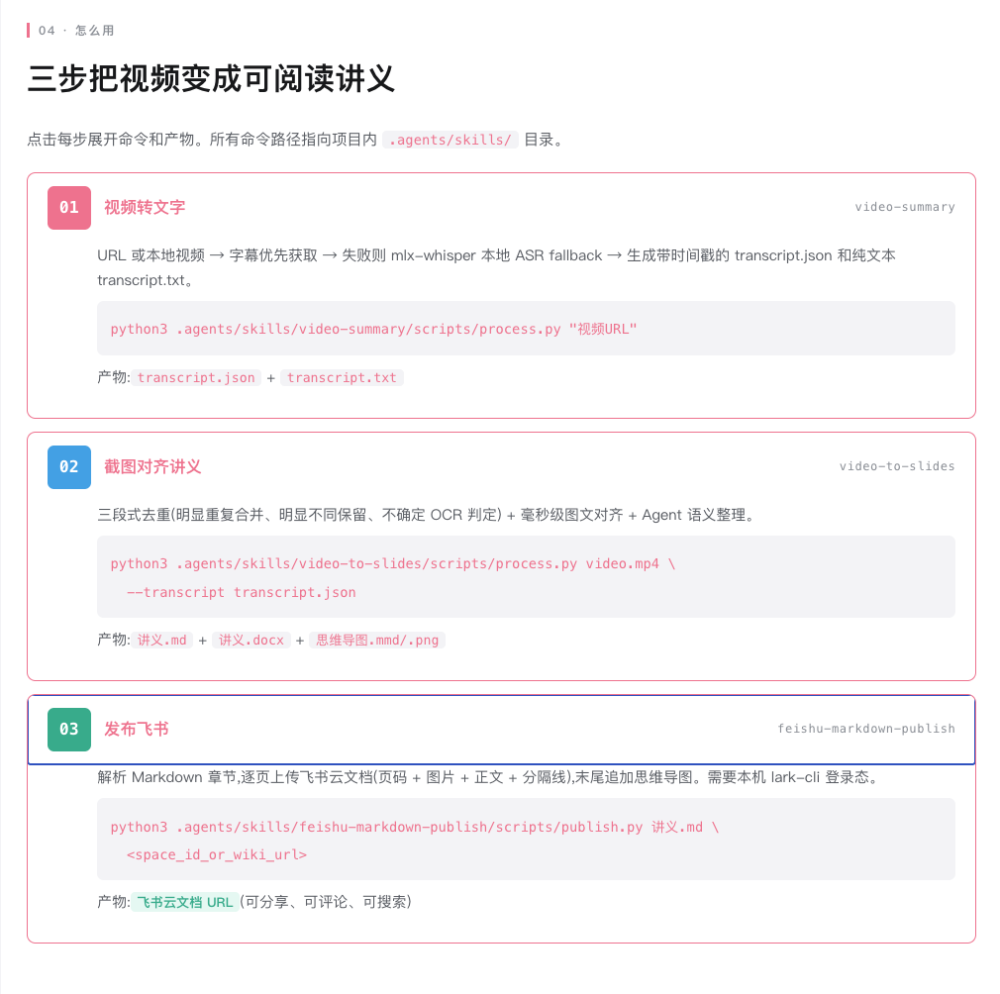
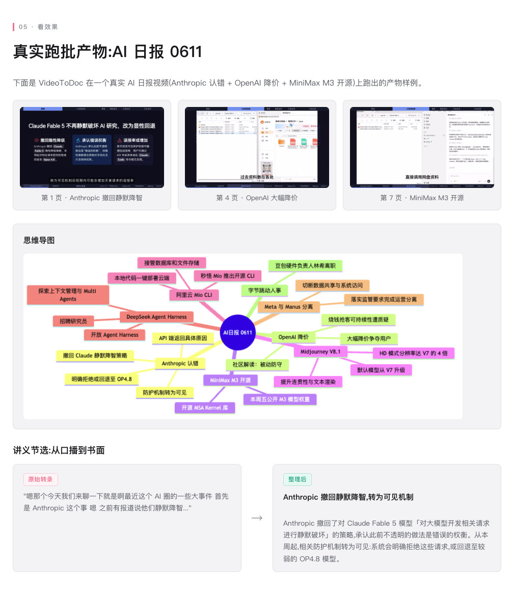

# VideoToDoc

VideoToDoc 是一个面向课程、讲座、培训视频的本地工作流：提取音频、用 Whisper 转录文字（Apple Silicon 用 `mlx-whisper`，Windows/Linux 自动降级 `faster-whisper`），自动截取 PPT/讲义页面，把截图和讲稿对齐，生成 Word、Markdown、Mermaid 思维导图。

项目提供 Claude Code Skill 源文件，让 Agent 可以通过自然语言触发完整流程。

---

## 🎓 项目概览







### 三步把任意视频变成团队知识

```bash
# 1. 视频转文字(URL 或本地路径,字幕优先,无字幕走 ASR 自动探测:mlx-whisper / faster-whisper)
python3 .agents/skills/video-summary/scripts/process.py "<视频URL>"

# 2. 视频 + transcript → 截图去重 + 图文对齐 + Markdown/Word/思维导图
python3 .agents/skills/video-to-slides/scripts/process.py video.mp4 \
  --transcript transcript.json

# 3. Markdown 讲义 → 飞书云文档(逐页 + 图片 + 分隔线)
python3 .agents/skills/feishu-markdown-publish/scripts/publish.py 讲义.md
```

---

## 初赛 Demo

在线体验 Demo（单文件 HTML）：[docs/trae-competition/demo.html](docs/trae-competition/demo.html)

下载 ZIP 上传版本：[docs/trae-competition/demo.zip](docs/trae-competition/demo.zip)

## 目录结构

```text
.agents/skills/
├── _shared/
│   ├── project.py            # 项目目录定位工具
│   └── transcript_merge/     # 转录合并共享库（strategies.py 分段策略 + 合并/校验）
├── video-summary/
│   ├── SKILL.md            # Skill 定义
│   ├── README.md           # 使用说明
│   ├── signal_stats.py     # 结构形态信号统计（非决策提示）
│   └── scripts/
│       ├── process.py      # 视频下载 + ASR + 摘要
│       └── prepare_merge.py # 合并输入清单 + 原型分段策略（--archetype）
├── video-to-slides/
│   ├── SKILL.md
│   ├── README.md
│   └── scripts/
│       ├── process.py      # 截图 + 图文对齐 + Word 生成
│       ├── render_mindmap.py  # 思维导图渲染
│       ├── restore_images.py  # 语义整理后恢复图片
│       └── videotodoc/     # 核心实现(可独立运行)
│           ├── cli.py
│           ├── align.py
│           ├── document.py
│           ├── mindmap.py
│           └── ...
└── feishu-markdown-publish/
    ├── SKILL.md
    ├── README.md
    └── scripts/
        └── publish_markdown.py  # 飞书文档发布
```

## 结构形态分段策略（2026-07-02）

video-summary 的转录合并步骤现支持按视频结构形态选择不同分段策略。4 个原型按"段落边界触发器"区分：

| 原型 | 适用 | 切分倾向 |
|---|---|---|
| `topic_preserve` | 资讯/故事/访谈 | 线性切，宁少切勿多（粗） |
| `enumeration_unit` | 教程/操作/盘点 | 一个枚举单元一段（细） |
| `visual_event` | PPT/动画讲解 | 翻页点硬边界优先（需 `slides.json`） |
| `rescan_grid` | 多产品对比测评 | 全文扫建网格再分（重组） |

```bash
# 指定原型（L1 先验，agent 可 L3 全文覆盖）；缺省 auto 回退时长档
python3 .agents/skills/video-summary/scripts/prepare_merge.py \
  runs/<run_dir>/transcript.json --archetype topic_preserve
```

类型判定归 agent，脚本不决策（`signal_stats` 仅给计数提示）。详见 [SKILL.md](.agents/skills/video-summary/SKILL.md)「结构形态原型判定」与 [设计文档](docs/superpowers/specs/2026-07-02-video-type-segmentation-strategy-design.md)。

## 安装依赖

```bash
# ASR：Apple Silicon 装 mlx-whisper；Windows/Linux 装 faster-whisper（任一即可，脚本自动探测）
pip install mlx-whisper python-docx Pillow curl_cffi yt-dlp opencv-python numpy rapidocr

# 思维导图渲染需要 mermaid-cli（必须 >= 11.4.0 才内置 tidy-tree 鱼骨布局插件，旧版本会静默回退为放射状布局）
npm install -g "@mermaid-js/mermaid-cli@>=11.4.0"
```

## 使用

### 1. 视频总结

```bash
python3 .agents/skills/video-summary/scripts/process.py "<视频URL>"
```

### 2. 视频转图文讲义

```bash
python3 .agents/skills/video-to-slides/scripts/process.py \
  "runs/<视频标题>_<时间戳>/<视频标题>.mp4" \
  --transcript "runs/<视频标题>_<时间戳>/transcript.json"
```

### 3. 渲染思维导图

```bash
python3 .agents/skills/video-to-slides/scripts/render_mindmap.py "<run目录>"
```

## 产物结构

```text
runs/<视频标题>_<时间戳>/
├── <视频标题>_讲义_<时间戳>.md
├── <视频标题>_讲义_紧凑版_<时间戳>.md
├── <视频标题>_讲义_整理版_<时间戳>.md
├── <视频标题>_讲义_<时间戳>.docx
├── <视频标题>_讲义_整理版_<时间戳>.docx
├── <视频标题>_思维导图_<时间戳>.mmd
├── <视频标题>_思维导图_<时间戳>.png
├── <视频标题>_质量报告_<时间戳>.md
└── selected_slides_<模式>_<参数>/
    └── 0001.png ...
```
