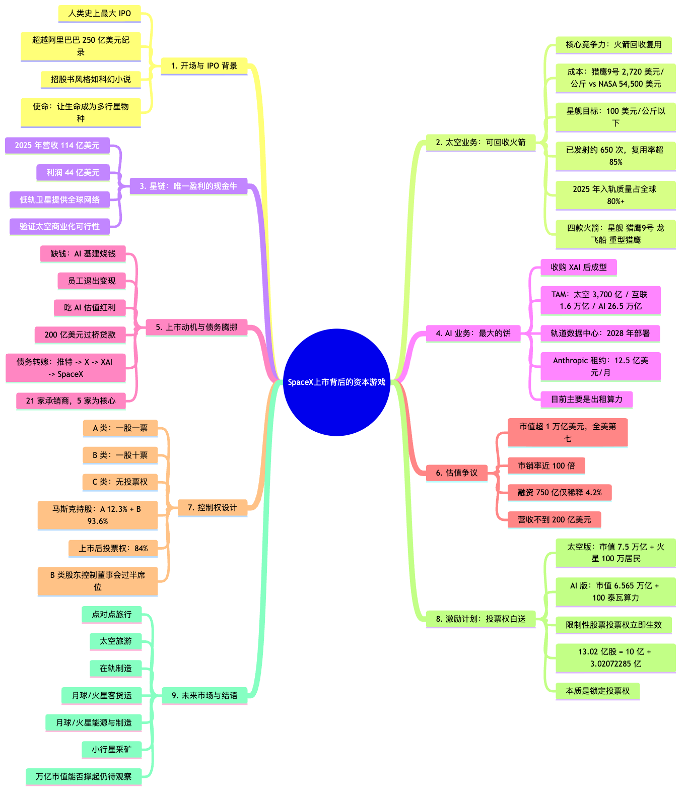

# SpaceX上市，背后在玩什么资本游戏？

- **第一章 开场与 IPO 背景**（00:29 - 01:14）：SpaceX 完成人类史上最大 IPO，招股书风格如科幻小说
- **第二章 太空业务：可回收火箭**（01:32 - 03:59）：猎鹰 9 号、星舰、发射成本与复用数据
- **第三章 星链：唯一盈利的现金牛**（04:14 - 05:58）：营收 114 亿美元、利润 44 亿美元，验证太空商业化
- **第四章 AI 业务：最大的饼**（05:58 - 09:00）：TAM 26.5 万亿美元、轨道数据中心、XAI 收购
- **第五章 上市动机与债务腾挪**（09:13 - 10:14）：为何上市、200 亿美元过桥贷款、承销商布局
- **第六章 估值争议：万亿市值撑得住吗？**（10:29 - 13:14）：市销率近 100 倍、融资 750 亿仅稀释 4.2%
- **第七章 控制权设计**（13:29 - 15:12）：A/B/C 三类股、马斯克 84% 投票权、控制董事会
- **第八章 激励计划：投票权白送**（15:12 - 18:12）：Moon Shot Plan、火星殖民、100 泰瓦算力
- **第九章 未来市场与结语**（18:30 - 21:44）：太空旅行、小行星采矿与市值展望

---

### 第 1 页 · 00:29 - 00:45

SpaceX刚刚完成了人类史上最大的IPO，在这之前你知道美股最大的IPO是谁吗，还是12年前的阿里巴巴，SpaceX这家公司之前一直都非常神秘，我们在新闻里也就看到一些零星的报道，什么筷子加火箭啊，要么火箭炸了，要么是STARLINK，还要弄什么太空数据中心等等，就很碎，而上市的一大好处呢，就是它的公开财务报表呀，好家伙好几百页的招股书，这里头还是藏了不少挺有意思的东西，而且我跟你说，马斯克为了控制权，还在SpaceX上进行了一个史无前例的玩法，我当时发现的时候非常震惊，我们就赶紧来看看，SpaceX它上市背后的资本游戏，它这个招股说明书吧，挺特别的，就跟看科幻小说似的。

---

### 第 2 页 · 00:56 - 01:14

还是那种带彩色插画吧，上来先跟你说，我们的使命是让生命成为多行星物种，探索宇宙的本质，并将意识之光延伸至星辰之间，是不是有那味儿了哈，然后就放了好几页纸片，都特别漂亮，你看看，上来不是先给你摆数据，而是烘托情绪，渲染气氛，就是说，我们可不是你们平时投资的那些公司，我们的使命是站在地球，站在人类这个高度，然后就是几百页非常详细的业务，财务数据这些介绍，这个招股书呢，把SpaceX整个业务，分成了这么三大部分。

---

### 第 3 页 · 01:32 - 01:45

首先第一块，就是它的王牌业务，太空，Space，主要就是造大火箭，但它关键力还在哪呢，不光是能上天，关键是它能回收，而回收的关键呢，不光是看着酷炫，它主要是便宜，NASA原来一公斤的东西，送上近地轨道，成本大概是，54500美元，而SpaceX的猎鹰9号。

---

### 第 4 页 · 02:07 - 02:14

大概是，2720美元，降到了NASA的二十分之一，而目前在测试的星舰，理论上要把这个成本，降到100美元以下，那就还不到原来，NASA的千分之二，你这么一算，要是把我送到近地轨道上，也就不到5000美元，也不知道我算这个干什么，根据它这个招股书，截止到今年的3月31号，SpaceX已经大概完成了，650次发射，这里头超过85%。

---

### 第 5 页 · 02:14 - 02:30

都是那种再利用的推进器发射，2025年，它送上轨道的质量，占了全球的80%以上，这部分技术呢，说实在的SpaceX，那就是没话说，就是厉害，就它那个，助推器回收，筷子夹火箭的画面，就算你什么技术都不懂。

---

### 第 6 页 · 02:30 - 02:45

第一次看到人类能完成，这种技术，真的不得不感叹，牛，我估计很多朋友可能看乱七八糟，各种火箭的这些切片，又是星舰，又是猎鹰，什么V1，V2，V3，感觉很乱，对吧，我给你们捋一捋，你看这是它官网显示的火箭，有这么4款，星舰，龙飞船，猎鹰9号，还有重型猎鹰，这里边最重要的是这俩，星舰和猎鹰9号，这个猎鹰9号呢，可以说是SpaceX走到今天的头号工程，2015年的时候。

---

### 第 7 页 · 03:16 - 03:30

第一次成功回收了一级火箭，马斯克当时，开心的就像个小男孩，从此人类也开启了火箭的复用时代，咱们刚才看，那个SpaceX非常亮眼的发射数据，这里头绝大部分，都是猎鹰9号完成的，它发射火箭的成功率，能超过99%，而这个星舰呢，它是一个还在研发阶段的，超重型运载火箭，毫不夸张地说，这个应该是目前SpaceX，最最最最最大的核心竞争力。

---

### 第 8 页 · 03:30 - 03:46

它的一大特点呢，就是，分成两级，上面是飞船，下面是超重型推进器，这两级最终的目标，是想要都分别回收的，截止到26年5月，下面推进器这部分，已经成功回收了好几次了，就是那个筷子加的模式，而上面飞船的部分呢，到目前为止，就只是实现了，在海面上的受控降落，其实就是软着陆，在海面上预定的位置。

---

### 第 9 页 · 03:46 - 03:59

然后销毁，总之还在测试阶段，现在正在研发的是第三代V3，然后剩下两款火箭，这个龙飞船，主要就是载人运货的，重型猎鹰呢，其实就是把三个猎鹰9号，绑一起，这样一个重型火箭，计划之后，是会被这个星舰替代掉，大概就这么几款，大家可以有个概念。

---

### 第 10 页 · 04:14 - 04:29

那这种研发火箭，还要回收，你用脚指都想都知道，它肯定非常烧钱，对吧，虽然它现在已经拿下了，很多美国政府，美国军方的订单，25年营收超过40亿美元，但这部分业务，单独来看还是亏的，25年亏损是6.57亿美元，所以说太空这块，可以说是SpaceX的技术发动机，但不是利润发动机，那利润发动机是什么呢。

---

### 第 11 页 · 04:29 - 04:45

就是这第二部分，互联Connectivity，可能大家更熟悉的一个词是，星链Starlink，25年这部分的营收是114亿美元，利润是44亿，也是这三部分里头，唯一赚钱，星链计划，相信大家应该都有所耳闻了，就是在这个地球的低空轨道上，部署上万颗卫星，来给全球提供网络，你看这个，就是星链实时的卫星分布，这个密度，是不是还挺夸张的，它的技术呢。

---

### 第 12 页 · 04:45 - 04:59

其实现在没那么难，但难就难在，你怎么能低成本，高效率的，把那么多卫星给送到天上去，所以它本质其实是，SpaceX火箭业务，众多商业化路径之一，大家看好SpaceX，确实很主要一块，是因为星链。

---

### 第 13 页 · 05:14 - 05:29

但不是因为它赚的那点钱，甚至也不是因为，它未来的潜力，而关键是星链，它向市场，向投资人证明了，SpaceX，把太空商业化的一个可行性，你看，我这个太空梦，不是纸上谈兵，我也不需要总依赖，什么政府，NASA，我自己就是可以赚钱。

---

### 第 14 页 · 05:29 - 05:45

那之后，我在天上，干什么都是有可能的，钱力有多大，你们就自己下去吧，我是要把意识之光，延伸至星辰之间，那是吗，我这插一嘴，就这个星链，我之前好几次坐飞机，包括今年去南极的时候，就用了它的那个网络，你别说，你还真别说，就在这种比较少数，极端的情况下。

---

### 第 15 页 · 05:45 - 05:58

它那个网，还是真挺不错的，什么刷个视频，开个会，工作，都完全没有压力，从这个角度看，星链确实是，有挺大的体验提升，我不是打广告，就纯粹是我个人的感受，来分享一下，好，我们继续来看SpaceX。

---

### 第 16 页 · 05:58 - 06:12

它的第三块业务版图，我估计猜都能猜出来了，就是AI，是它在今年收购，XAI之后成型的，这部分吧，我觉得，它不光是一个业务版图，更像是一个，巨大的饼，这饼有多大，咱来看看，马斯克，他用了一个指标，叫TAM，Total Addressable Market，总潜在市场，咱们刚才说的。

---

### 第 17 页 · 06:12 - 06:29

第一部分业务，太空，这个总潜在市场，是3700亿美元，互联呢，可以达到1.6万亿，而AI，总共是26.5万亿美元，你看，要不我说它是个大地方，AI这持续亏钱，市场潜力，已经26.5万亿美元了。

---

### 第 18 页 · 06:29 - 06:44

意思就是说，市场，你们看啊，我们现在估值，它哪跟哪呢，这以后潜力大是，而且我跟你说，这张图，它是整个几百页，招股书里边，出现的第一张图表，你可见这个的重要性，估计就是因为。

---

### 第 19 页 · 06:44 - 06:59

之后几百页的招股书，看着多累啊，你不饿吗，先吃口饼，注意啊，这我稍微解释一下，我刚才说什么，讲故事啊，画饼，用词可能稍微有点调侃，大概意思就是说，SpaceX，还处在它一个，非常宏大的，商业叙事的早期阶段，并不是说，马斯克就达不到嘛，这块我，还是有比较强调一下。

---

### 第 20 页 · 06:59 - 07:14

那咱顺着，它这个AI的故事来看，它打算怎么实现，这20多万亿的潜力呢，目前公开的，就是它要在太空建这种超大型，轨道数据中心，让数据中心像卫星一样，在天上飞，靠太阳能供电。

---

### 第 21 页 · 07:31 - 07:45

然后向太空去辐射散热，这样去解决能源散热的瓶颈，最早会在2028年开始部署，这个我们之前视频也讲过，这个虽然听着很宏大很遥远，但多多少少还有点概念，是吧，但你等一下，这其实只对应了，2.4万亿美元的AI基础设施，后面这22.7万亿的企业应用，这才是大头，这什么意思呢，我也好奇啊，我就开始在这个招股书里头，翻啊找啊，好不容易，在176页，藏了对这个概念的解释，什么叫企业应用呢，它是这么说的，通过自动化日常认知任务。

---

### 第 22 页 · 08:00 - 08:15

协助研究和分析，生成内容和代码，以及优化决策过程，越来越多的支持，各行各业的知识工作者，最终我们认为，这一变革可能会将知识工作者，转变为自主智能体的，赋能管理者，释放前所未有的创造力，和生产力水平，好家伙，你看懂了吗，你能看懂那就乖了，是不是感觉，每个字都认识，但放在一起，既高级又一头雾水，你要强行理解，大概就是，AI智能体机器人，替我们上班嘛。

---

### 第 23 页 · 08:29 - 08:46

不过它这个AI业务，也不是纯空想，人家毕竟已经收购了XAI嘛，25年营收是32亿美元，而就在5月份，SpaceX还公布了一个，非常重要的合约，把它的Torosis数据中心，租给了Anthrobic，每个月收12.5亿美元，到2029年5月到期，这个倒是实打实的合同了，也很多，但就没那么性感，跟太空关系不大，而且也不是训练自己的模型，是把算力租给别人，而且这个数据中心的业务，竞争其实也非常激烈，你得跟那么多大厂去混战。

---

### 第 24 页 · 08:46 - 09:00

总之，这个AI部分，要想接近马斯克说的，20多万亿美元的潜在市场，我只能说，道路还很漫长，这个就是SpaceX大致的，三大块业务，太空业务是技术底座，互联业务是赚钱机器，而AI是未来，是投资，也是真烧钱，他讲的故事，大概就是，拥有大火箭这个核心技术，就垄断了一切，太空故事的叙事权。

---

### 第 25 页 · 09:13 - 09:28

然后通过星链，验证这个故事，是真的能实现的，再站在AI的风口，讲一个庞大的，太空AI故事，让估值起飞，大概是这么个意思，好，咱现在了解了，他大致的业务，那接下来咱来看看，你说他为什么要上市，你可别想，当然觉得上市好啊，一下子变现，赚钱谁不喜欢，对于咱普通人来说，上市实现财富自由，肯定没跑，但对马斯克。

---

### 第 26 页 · 09:28 - 09:44

那就不一样了，上市最关键的弊端是什么呢，你财务信息得公开，你的控制权会被稀释，而且一旦有个负面新闻，或者财务表现不好，你就得出来解释，就会受到资本市场和舆论，持续不断地裹挟，你就得不停地去应付，合规，舆论，资本，等等这些。

---

### 第 27 页 · 09:44 - 10:02

这对于世界首富马斯克来说，成本是极高的，这也是为什么，他之前其实就说过，过早的上市，会让SpaceX非常痛苦，但25年，马斯克改口了，确认了26年的上市计划，你说具体是为什么，其实首先第一个原因，确实是缺钱，当然不是说他，太空那部分业务缺钱。

---

### 第 28 页 · 10:29 - 10:45

那部分靠星链，已经完全能养活了，而像我们刚才说的，缺钱其实主要是这个，AI，这也是为什么，你看23年的时候，SpaceX几乎没什么融资债务，但到24年，AI市场爆发，他融资一下就涨到了118亿，25年又变成了263.5亿，这个AI基建花钱，也不难理解，我就不废话，但融资这儿，我跟你说，有一块挺有意思的，就是他26年的融资里，不光是私募股权融资，还藏了一笔200亿美元的，过桥贷款，那啥叫过桥贷款呢，就是他不是，长期借给你发展业务的，而就是短期帮你过个桥的，过什么桥呢，就是收购XAI上市，你看他收购XAI。

---

### 第 29 页 · 11:14 - 11:32

那就会继承过来，一屁股XAI的债，所以SpaceX，他也得先借钱，把这笔债还上，然后等SpaceX上市了，有钱了，再把这笔还上。那XAI，为什么会有那么多债呢，你可别蠢以为，就是因为做AI烧钱，他这大概，在175亿美元的债务里头，AI基建，大概只占了50亿，而剩下那125亿，是当年，马斯克收购，推特的时候背的债，这什么乱七八糟，晕了吗，我给你大概捋一下，22年，马斯克轰轰烈烈，收购推特，借了125亿美元的债务，之后把推特改定为X，然后25年，XAI收购了X，就继承了那125亿美元的债，26年，SpaceX又收购了XAI，就继承了那125亿，加上XAI，50亿美元的债，然后，SpaceX，借了一笔过桥贷款，而原来那些债，一口气全还清了，现在变成了SpaceX的新债。

---

### 第 30 页 · 11:32 - 11:44

最后他上市，把这笔过桥贷款，再还掉，我跟你说，这回这些投行里头，最高兴的，应该就是，摩根士丹利了，因为当年，马斯克收购推特，那100多亿的债，主要就是管，摩根士丹利借的，这也成了华尔街史上，被套牢最久的，并购债之一了，这回终于解套，还能顺便赚一笔，IPO的承销费，开心坏。

---

### 第 31 页 · 12:00 - 12:14

而且我跟你说，这笔过桥贷款，背后的借贷银行，阵容真是，极其之豪华，有高盛，美国银行，花旗，摩根大通，摩根士丹利，为什么呀，就为了这200亿的，短期债吗，至于吗，我跟你说，这些投行都不傻，各顶各的精，这个过桥贷款，它只是个敲门砖，只是个钱菜。

---

### 第 32 页 · 12:14 - 12:28

那真正的主菜是什么呢，就是那笔史上，最大的IPO，他们为的是能承销，这笔IPO，那承销费可就赚海了，所以你看最终，SpaceX的承销商，有21家银行，但其实这里头最主要的，就是第一排这五位，正好就是给他提供。

---

### 第 33 页 · 12:28 - 12:45

过桥贷款的那五位，好 又扯远了，咱刚才聊什么呢，SpaceX为什么要上市，刚才我们说的是，它缺钱这个原因，还有呢，就是为了老员工，可以退出变现，再有一点，这点纯粹是我个人的猜测，就是AI资本热，这么一起来，整个AI的估值都到天上去了。

---

### 第 34 页 · 12:59 - 13:14

所以SpaceX，极有可能也想吃到这波红利，其实现在SpaceX上市，没有人怀疑它的火箭牛，而争议最大的是什么呢，就是它能不能撑得起，这1万多亿的估值，你看它一上来，就是全美市值第七大的公司，已经超过特斯拉了，真的是非常夸张，这个估值是什么概念呢，你就看跟它估值，类似的这些公司的营收，沃尔玛是7000亿，Meta 2000亿，博通 以来 特斯拉，都属于高科技产业，营收也都是600亿往上，但SpaceX只有不到200亿，一般我们看估值。

---

### 第 35 页 · 13:29 - 13:47

主要是看市盈率，就是市值除以低率，但SpaceX它亏钱，没赚钱，没法算市盈率，这个对于一般刚上市的公司也合理，那能看什么呢，可以看市销率，就是市值除以销售额，这个指标呢，比如说苹果是10倍，特斯拉是15倍，英伟大是25倍，而你知道SpaceX是多少吗，IPO空降就接近100倍，这是美股里头最高的，所以你能看出来，真的是有很大一部分人，用真金白银去投票，就觉得SpaceX值这个价，对它有信心。

---

### 第 36 页 · 14:01 - 14:13

那估值高，对于SpaceX来说，意味着什么呢，就是它可以以一个，非常非常低的成本，去融资，你看啊，咱说之前美股最大的IPO，是阿里巴巴，它当时融了250亿美元，消耗了自己大概15%的股份，而SpaceX，融750亿，只消耗了4.2%，这么便宜的融资，这么高的估值。

---

### 第 37 页 · 14:13 - 14:30

也成为它选择，现在这个时间点上市的，一个重要原因之一，关于SpaceX，其实还有一个非常重要的点，我没讲，你看咱这重点都藏在后面，就是马斯克的控制权，我们知道，马斯克之前在公司的控制权上，带过好几次梗头，你比如说，他当PayPal CEO的时候，在飞往澳大利亚，度蜜月的飞机上，直接被董事会罢免了。

---

### 第 38 页 · 14:30 - 14:47

你再比如说OpenA，也可以说是有点狼狈的，被提出来了，包括特斯拉，你以为他就全说了算吗，马斯克就算乱七八糟，各种股权加起来都算上，特斯拉的投票权，他也只占20%出头，想干什么，还得经常对董事会，以辞职相要挟，恨不得刀得架在自己脖子上才行。

---

### 第 39 页 · 14:59 - 15:12

所以马斯克这回也是，吃一堑长一智，一定要用尽各种方法，把SpaceX的控制权，牢牢攥在自己手里，他虽然公司上市了，Go Public，但这个控制权，一点都不能Public，咱来看看他是怎么控制的，我跟你说，他的这个掌控权，甚至可以说严格到变态，SpaceX它的普通股，分这么三类，A类是一股一票，B类是一股十票，C类是一股零票。

---

### 第 40 页 · 15:12 - 15:31

那这个没有投票权，我们先不管，在上市之前呢，马斯克手里有12.3%的，A类股票和93.6%的，B类股票，加总起来，他占公司投票权，是85.1%，而这次上市呢，对外融的也只是A类股票，这个B类还是，马斯克自己牢牢控制，我简单算了一下。

---

### 第 41 页 · 15:31 - 15:42

上市之后，马斯克的控制权，从原来的85%，降到了84%，而且这还没完哈，他自己还觉得不保险，他在这个SE里头还规定，说B类股东，有权选举，董事会里过半的董事，也就是说，B类股的股东，可以控制董事会，而马斯克在这个，B类股的股东里。

---

### 第 42 页 · 15:42 - 15:59

占了93.6%，也就是说，甭管他对外进行多少轮，A类股的融资，马斯克都始终可以，控制董事会，怎么样，很晚，所以美国的，三大公共养老金，也发出了联名性警告，说SpaceX这套结构，真的是新奇又极端，大概就是说，闻所未闻。

---

### 第 43 页 · 16:15 - 16:30

然后关于马斯克呢，这个招股书里，还藏着一个，非常有意思的信息，就是他的激励计划，我觉得这个，其实有点，番外篇的意思，我说说吧，你听听了，在这个235页的地方，就这么简简单单，非常笼统地，形容了一下，但这背后，其实是一个极其庞大，你听完甚至会觉得，很扯的激励计划。

---

### 第 44 页 · 16:30 - 16:45

不太熟悉，什么叫激励计划的朋友，我稍微说一嘴，简单来说就是，董事会为了激励马斯克，专门给他定了一套目标，只要他达到这些目标，就会额外获得，多少多少多少的，股票奖励，特斯拉已经做过，三轮这种激励计划了，马斯克全都打到了，董事会一看，这招好呀，对于马斯克这种奇人，就必须要有，奇特的激励。

---

### 第 45 页 · 17:02 - 17:14

之后这些目标，定的越来越离谱，被称作，Moon Shot Plan，我觉得大概可以，把它翻译成，极限挑战，25年底的时候，特斯拉又轰轰烈烈地，给马斯克开出了，第四轮极限挑战，有一大堆目标，这里头比较主要的，是特斯拉的市值，要达到8.5万亿，是当时特斯拉市值的8倍，如果这些目标全达到，马斯克将获得，价值1万亿美元的，特斯拉股票作为奖励，这是特斯拉，那咱来看SpaceX，我这么说吧，相比较而言。

---

### 第 46 页 · 17:29 - 17:42

特斯拉那个就已经是，非常容易达到了，SpaceX给出的计划呢，咱看看，就这么短短的一页里边，还有两版激励计划，一个是太空版，一个是BI版，太空版大概是这样的，它分了15个阶梯，就是说SpaceX的市值，达到这么多，马斯克就会获得，相应的股票奖励，这里头最高的这一档，是7.5万亿的市值，马斯克会获得，10亿股的限制性股票，你是不是感觉，7.5万亿。

---

### 第 47 页 · 17:42 - 18:01

好像也没有那么扯，对吧，它高是高，但是它的估值，已经完成三个目标了，再往上翻五倍，也还好，但你仔细看好了，它的这个要求里边，还有第二条，你达到这个市值指标的同时，还必须在火星上，建立永久人类殖民地，并达到至少100万居民，这你直观想，完全不是一个量级，这肯定非常遥远了，如果它真的能在火星上，搞100万居民。

---

### 第 48 页 · 18:01 - 18:12

那我想它市值，肯定远不止7.5万亿了，这俩完全不是一个难度，对吧，其实哈，我仔细一想，它也不是不可能达到，如果我们咬文嚼字的话，这100万居民，不一定非得是人类呀，我也可以是小猫，小狗，或者土豆什么的，我就可以让这个火星上，有一个人类居民。

---

### 第 49 页 · 18:30 - 18:42

那也算人类殖民地了，然后我给它配上100万个土豆，这样难度会小很多，开玩笑的，总之这100万火星居民，这个计划你听听，是吧，然后是AI那版，也没强到哪去，首先市值要达到一定的标准，这回是6.565万亿美元，比太空版还低一点，但同时必须要建立，非地球数据中心，达到每年100泰瓦的算力，大家可能没概念，我们经常听说，几瓦现在一个超大数据中心，是一几瓦的算力。

---

### 第 50 页 · 18:54 - 19:16

那泰瓦呢，一泰瓦等于一千几瓦，所以100泰瓦就是10万几瓦，目前全球的总用电量，大概也只有3泰瓦，100泰瓦就相当于是，目前全球总功耗的33倍，还得是在外太空打造，你看这两个极限挑战，一个要100万的火星殖民，一个要在太空实现100泰瓦算力，两个这么扯的计划，是为什么呢，你仔细想一下，其实这个答案很简单，就是这个激励计划，它设计的初衷，压根就没打算让马斯克实现，你可能要问了。

---

### 第 51 页 · 19:27 - 19:40

那干嘛还费这么大劲，设计这个激励计划呢，是为了凑字数吗，那肯定不是，当然一部分原因，也是为了激励马斯克，万一人就实现了，但另外关键的原因，甚至没写在这个，招股书的正文里，而是藏在了这个激励计划的，附加条款里，你看吧，他说参与人，享有B类股持有人的，全部权利和特权，包括投票权，自授予日起，立即生效，什么意思呢，就是说马老板。

---

### 第 52 页 · 19:59 - 20:16

就算您最后完不成目标，股票拿不到，但从今天开始，这些股票对应的投票权，就全归您了，不需要完成什么极限挑战，所以咱刚才不是说，马斯克有93.6%的，B类股票吗，你要是仔细看，他批注里，有一行小字就说了，这55亿股的B类股里头，包含了13亿0，2072285股的限制股，那哪来的13亿限制股呢，哎 业绩同学们。

---

### 第 53 页 · 20:16 - 20:31

我们把课本再翻回到地，235页这个激励计划这儿，太空版给了马斯克多少股呢，对 是10亿股，AI版给了多少呢，3亿02072285股啊，哎 一加是多少，13亿02072285股，最少，这不就明了了吗，这两个极限挑战，虽然几乎不可能完成，但投票权已经算了，马老板投上了，这哪是什么极限挑战计划呀，应该就叫，投票权白送计划。

---

### 第 54 页 · 20:43 - 20:58

咱再来看看SpaceX，它自己列出来的，未来可能的市场，它的一个畅想，这些我就不评价了，我也不敢评价，纪念点对点旅行，太空旅游，在轨道上制造，前往月球和火星的，客运和货运，在月球和火星上生产能源，月球和火星上制造，还有小行星采矿，好 这些呢。

---

### 第 55 页 · 20:58 - 21:14

就是关于SpaceX上市，还有资本操作，一些我想简单聊聊的地方，它的估值，确实非常的夸张，我觉得可以说是马斯克，通过这么多年，成功的商业履历，带来的散户，资本 银行，对它的信任，从而转化成了非常高的，马斯克议价，有议价肯定合理，你想 同样业务的两家公司，一个CEO是马斯克，一个是小林。

---

### 第 56 页 · 21:28 - 21:44

那能一样吗，也正因为大家买它，是对于马斯克这个人的信任，所以它独揽控制权，在资本市场来看，也不是什么坏事，甚至有人觉得是好事，它还不用受到资本的裹挟呢，这个就仁者见仁，智者见智了，但不得不说，SpaceX上市，真的是把这个故事给讲全了，我也真的好奇，大家觉得三年以后的SpaceX，会变成一个什么样的公司，又撑不撑得起，它这么高的市值呢。

## 思维导图

