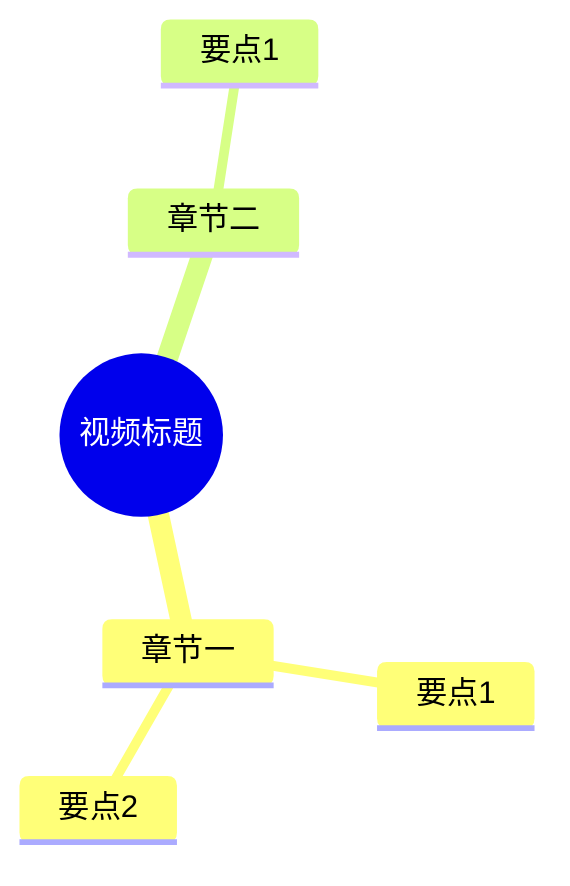

# 模块 B：新功能添加实施计划

> **For agentic workers:** REQUIRED SUB-SKILL: Use superpowers:subagent-driven-development (recommended) or superpowers:executing-plans to implement this plan task-by-task. Steps use checkbox (`- [ ]`) syntax for tracking.

**Goal:** 为 VideoToDoc 新增移动端 HTML 讲义、响应式图片、可交互时间戳、子代理自动化（语义合并/目录/整理/思维导图）、多语言 ASR 与未来扩展能力。

**Architecture:** 按优先级分三阶段——P0 移动端体验（HTML 产物 + 响应式图片 + 时间戳）、P1 子代理自动化与多语言、P2 未来扩展。每个任务 TDD 驱动，子代理方案取代 LLM API 调用以保持 skill 通用性（下载即用，无需配 API key）。

**Tech Stack:** Python 3.11+、Jinja2、Pillow（WebP 转换）、pytest、Mermaid、subprocess、Task 工具（子代理）

## Global Constraints

- 不破坏现有 CLI 接口与产物（Markdown/Word/思维导图保持不变）
- 新增 HTML 产物为**可选**，由 `--html` 开关启用，默认关闭
- 子代理自动化为**可选**，由 SKILL.md 指示 Agent 派发，不引入 API key 依赖
- 响应式图片不删除原图，WebP 为副本
- 时间戳跳转链接格式：`t=HH:MM:SS`（YouTube 风格，兼容性强）
- 所有新增功能必须有对应测试
- 提交信息用 `feat:` 前缀
- 每个任务结束前运行 `pytest tests/ -v` 确保不回归

## 文件结构映射

| 文件 | 职责 | 本计划涉及任务 |
|---|---|---|
| `videotodoc/html_renderer.py`（新建） | Markdown → 响应式 HTML 讲义 | T1, T2, T3 |
| `videotodoc/image_ops.py`（新建） | 图片 WebP 转换、srcset 生成 | T2 |
| `videotodoc/timestamp.py`（新建） | 时间戳注入与跳转 | T3 |
| `videotodoc/document.py` | 集成 HTML 产物到 pipeline | T4 |
| `videotodoc/pipeline.py` | 流水线编排增加 HTML 阶段 | T4 |
| `videotodoc/config.py` | 新增 HTML/WebP 配置项 | T1, T2 |
| `videotodoc/asr.py` | 多语言 ASR + 术语词典 | T8 |
| `video-summary/scripts/process.py` | 多语言 ASR 与分片 | T8 |
| `.agents/skills/video-to-slides/SKILL.md` | 子代理自动化指令 | T5, T6, T7 |
| `.agents/skills/_shared/subagent_prompts/`（新建） | 子代理 prompt 模板 | T5, T6, T7 |
| `templates/lecture.html.j2`（新建） | HTML 讲义 Jinja2 模板 | T1 |
| `tests/` | 测试目录 | 全部任务 |

---

## 阶段 1：P0 移动端体验

### Task 1: HTML 讲义渲染器——骨架与响应式布局（B-P0-1）

**Files:**
- Create: `videotodoc/html_renderer.py`
- Create: `templates/lecture.html.j2`
- Modify: `videotodoc/config.py`（新增 `html_output: bool = False`）
- Test: `tests/test_html_renderer.py`

**Interfaces:**
- Produces: `render_html_lecture(title: str, sections: list[Section], output_path: Path, video_source: str | None = None, mindmap_image_path: Path | None = None) -> Path`

- [ ] **Step 1: 写失败测试**

```python
# tests/test_html_renderer.py
from pathlib import Path
from videotodoc.html_renderer import render_html_lecture
from videotodoc.models import Section, Slide, TranscriptSegment

def _make_section(idx, text="这是测试文字", image="img/01.png", ms=1000):
    slide = Slide(capture_ms=ms, image_path=image, hash="ab")
    seg = TranscriptSegment(start_ms=ms, end_ms=ms+2000, text=text)
    return Section(index=idx, title=f"第{idx}页", slide=slide, transcript=seg)

def test_render_html_produces_valid_html(tmp_path):
    sections = [_make_section(1), _make_section(2)]
    out = tmp_path / "lecture.html"
    result = render_html_lecture("测试讲义", sections, out)
    assert result.exists()
    content = out.read_text(encoding="utf-8")
    assert "<!DOCTYPE html>" in content
    assert "测试讲义" in content
    assert "这是测试文字" in content

def test_html_has_viewport_meta(tmp_path):
    """移动端必须有 viewport meta"""
    sections = [_make_section(1)]
    out = tmp_path / "lecture.html"
    render_html_lecture("t", sections, out)
    content = out.read_text(encoding="utf-8")
    assert 'name="viewport"' in content
    assert 'width=device-width' in content

def test_html_is_single_file(tmp_path):
    """产物应为单文件 HTML（CSS 内联），无外部依赖"""
    sections = [_make_section(1)]
    out = tmp_path / "lecture.html"
    render_html_lecture("t", sections, out)
    content = out.read_text(encoding="utf-8")
    assert "<style>" in content  # CSS 内联
    assert "<link" not in content or 'rel="stylesheet"' not in content

def test_html_disabled_by_default():
    """默认配置不产出 HTML"""
    from videotodoc.config import Settings
    s = Settings()
    assert s.html_output is False
```

- [ ] **Step 2: 运行测试确认失败**

Run: `pytest tests/test_html_renderer.py -v`
Expected: FAIL（`html_renderer` 模块不存在）

- [ ] **Step 3: 创建 Jinja2 模板**

```html
<!-- templates/lecture.html.j2 -->
<!DOCTYPE html>
<html lang="zh-CN">
<head>
<meta charset="UTF-8">
<meta name="viewport" content="width=device-width, initial-scale=1.0, maximum-scale=5.0">
<title>{{ title }}</title>
<style>
  :root {
    --max-width: 720px;
    --text-size: 16px;
    --line-height: 1.7;
    --img-radius: 8px;
  }
  * { box-sizing: border-box; }
  body {
    margin: 0 auto;
    max-width: var(--max-width);
    padding: 16px;
    font-size: var(--text-size);
    line-height: var(--line-height);
    font-family: -apple-system, BlinkMacSystemFont, "Segoe UI", Roboto, sans-serif;
    color: #1a1a1a;
    background: #fff;
  }
  h1 { font-size: 1.5em; line-height: 1.3; word-break: break-word; }
  h2 { font-size: 1.2em; margin-top: 1.5em; border-bottom: 1px solid #eee; padding-bottom: 0.3em; }
  .section { margin-bottom: 2em; }
  .section-image {
    width: 100%;
    height: auto;
    border-radius: var(--img-radius);
    border: 1px solid #eee;
  }
  .section-text { margin-top: 0.8em; }
  .section-text p { margin: 0.5em 0; }
  /* 移动端表格滚动 */
  .table-wrapper { overflow-x: auto; -webkit-overflow-scrolling: touch; }
  table { width: 100%; border-collapse: collapse; }
  th, td { padding: 8px; border: 1px solid #ddd; white-space: nowrap; }
  /* 移动端代码块 */
  pre { overflow-x: auto; -webkit-overflow-scrolling: touch; font-size: 0.85em; }
  code { background: #f6f8fa; padding: 0.2em 0.4em; border-radius: 3px; font-size: 0.9em; }
  pre code { background: none; padding: 0; }
  /* 时间戳跳转 */
  .timestamp {
    display: inline-block;
    background: #e8f0fe;
    color: #1a73e8;
    border-radius: 4px;
    padding: 0.1em 0.4em;
    font-size: 0.85em;
    font-family: monospace;
    text-decoration: none;
  }
  .timestamp:active { background: #d2e3fc; }
  /* 目录 */
  .toc { background: #f9f9f9; padding: 1em 1.5em; border-radius: 8px; margin-bottom: 2em; }
  .toc ul { padding-left: 1.5em; }
  .toc a { color: #1a73e8; text-decoration: none; }
  /* 思维导图 */
  .mindmap { width: 100%; height: auto; border-radius: var(--img-radius); }
  @media (max-width: 480px) {
    :root { --text-size: 15px; }
    body { padding: 12px; }
    h1 { font-size: 1.3em; }
    pre { font-size: 0.8em; }
  }
</style>
</head>
<body>
<h1>{{ title }}</h1>






<nav class="toc">
  <h2>目录</h2>
  <ul>
  
    <li><a href="#section-{{ item.index }}">{{ item.title }}</a></li>
  
  </ul>
</nav>



<div class="section" id="section-{{ section.index }}">
  <h2>{{ section.title }}</h2>
  
  <div class="section-text">
    {{ section.html_text | safe }}
  </div>
</div>

</body>
</html>
```

- [ ] **Step 4: 创建 html_renderer.py**

```python
# videotodoc/html_renderer.py
"""Markdown → 响应式 HTML 讲义渲染器"""
from pathlib import Path
from jinja2 import Environment, FileSystemLoader
import markdown as md

_TEMPLATE_DIR = Path(__file__).parent.parent / "templates"

def render_html_lecture(
    title: str,
    sections: list,
    output_path: Path,
    video_source: str | None = None,
    mindmap_image_path: Path | None = None,
    toc: list | None = None,
) -> Path:
    """渲染单文件响应式 HTML 讲义。

    Args:
        title: 讲义标题
        sections: Section 列表，每个含 index/title/slide/transcript
        output_path: 输出 .html 路径
        video_source: 视频源 URL（用于时间戳跳转），可选
        mindmap_image_path: 思维导图 PNG 路径，可选
        toc: 目录项列表 [{index, title}]，可选
    Returns:
        output_path
    """
    env = Environment(
        loader=FileSystemLoader(str(_TEMPLATE_DIR)),
        autoescape=False,
    )
    template = env.get_template("lecture.html.j2")

    # 把每段 transcript text 转 HTML
    for s in sections:
        s.html_text = md.markdown(
            s.transcript.text,
            extensions=["extra", "codehilite"],
        )

    html = template.render(
        title=title,
        sections=sections,
        mindmap_image_path=str(mindmap_image_path) if mindmap_image_path else None,
        toc=toc,
        video_source=video_source,
    )
    output_path.write_text(html, encoding="utf-8")
    return output_path
```

- [ ] **Step 5: 在 config.py 新增配置项**

```python
# videotodoc/config.py Settings dataclass 增加：
html_output: bool = False  # 是否产出 HTML 讲义（默认关闭）
```

- [ ] **Step 6: 安装依赖**

```bash
pip install jinja2 markdown
```

- [ ] **Step 7: 运行测试确认通过**

Run: `pytest tests/test_html_renderer.py -v`
Expected: ALL PASS

- [ ] **Step 8: 提交**

```bash
git add videotodoc/html_renderer.py templates/lecture.html.j2 videotodoc/config.py tests/test_html_renderer.py
git commit -m "feat: 新增 HTML 讲义渲染器，响应式布局，移动端友好"
```

---

### Task 2: 响应式图片——WebP 转换 + srcset（B-P0-2）

**Files:**
- Create: `videotodoc/image_ops.py`
- Modify: `videotodoc/html_renderer.py`
- Modify: `templates/lecture.html.j2`
- Modify: `videotodoc/config.py`（新增 `webp_quality: int = 82`）
- Test: `tests/test_responsive_images.py`

**Interfaces:**
- Produces: `generate_responsive_images(image_path: Path, output_dir: Path, sizes: list[int] = [640, 960, 1280]) -> ResponsiveImageSet`
- Produces: `ResponsiveImageSet` dataclass: `srcset: str, fallback: Path, width: int, height: int`

- [ ] **Step 1: 写失败测试**

```python
# tests/test_responsive_images.py
from pathlib import Path
from PIL import Image
from videotodoc.image_ops import generate_responsive_images, ResponsiveImageSet

def _make_test_image(path, w=1280, h=720):
    Image.new("RGB", (w, h), "blue").save(path)

def test_generates_webp_variants(tmp_path):
    src = tmp_path / "orig.png"
    _make_test_image(src)
    result = generate_responsive_images(src, tmp_path / "out", sizes=[640, 960])
    assert (tmp_path / "out" / "orig_640.webp").exists()
    assert (tmp_path / "out" / "orig_960.webp").exists()

def test_srcset_format(tmp_path):
    src = tmp_path / "orig.png"
    _make_test_image(src)
    result = generate_responsive_images(src, tmp_path / "out", sizes=[640, 960])
    assert "640w" in result.srcset
    assert "960w" in result.srcset
    assert ".webp" in result.srcset

def test_webp_smaller_than_png(tmp_path):
    src = tmp_path / "orig.png"
    _make_test_image(src)
    result = generate_responsive_images(src, tmp_path / "out", sizes=[1280])
    webp_size = (tmp_path / "out" / "orig_1280.webp").stat().st_size
    png_size = src.stat().st_size
    assert webp_size < png_size  # WebP 应更小

def test_dimensions_returned(tmp_path):
    src = tmp_path / "orig.png"
    _make_test_image(src, 1280, 720)
    result = generate_responsive_images(src, tmp_path / "out", sizes=[1280])
    assert result.width == 1280
    assert result.height == 720
```

- [ ] **Step 2: 运行测试确认失败**

Run: `pytest tests/test_responsive_images.py -v`
Expected: FAIL（`image_ops` 模块不存在）

- [ ] **Step 3: 创建 image_ops.py**

```python
# videotodoc/image_ops.py
"""响应式图片：WebP 转换 + srcset 生成"""
from dataclasses import dataclass
from pathlib import Path
from PIL import Image

@dataclass
class ResponsiveImageSet:
    srcset: str           # "img_640.webp 640w, img_960.webp 960w"
    fallback: Path        # 最大尺寸的 WebP（或原图 PNG）
    width: int            # 原图宽度
    height: int           # 原图高度

def generate_responsive_images(
    image_path: Path,
    output_dir: Path,
    sizes: list[int] | None = None,
    quality: int = 82,
) -> ResponsiveImageSet:
    """生成多尺寸 WebP + srcset 字符串。

    Args:
        image_path: 原图路径（PNG）
        output_dir: WebP 输出目录
        sizes: 目标宽度列表，默认 [640, 960, 1280]
        quality: WebP 质量（0-100）
    Returns:
        ResponsiveImageSet
    """
    if sizes is None:
        sizes = [640, 960, 1280]

    output_dir.mkdir(parents=True, exist_ok=True)
    stem = image_path.stem
    with Image.open(image_path) as img:
        orig_w, orig_h = img.size
        srcset_parts = []
        for w in sizes:
            if w > orig_w:
                continue  # 不放大
            h = int(orig_h * w / orig_w)
            resized = img.resize((w, h), Image.LANCZOS)
            webp_path = output_dir / f"{stem}_{w}.webp"
            resized.save(webp_path, "WEBP", quality=quality, method=4)
            srcset_parts.append(f"{webp_path.name} {w}w")

    fallback_name = f"{stem}_{min(max(sizes), orig_w)}.webp"
    return ResponsiveImageSet(
        srcset=", ".join(srcset_parts),
        fallback=output_dir / fallback_name,
        width=orig_w,
        height=orig_h,
    )
```

- [ ] **Step 4: 修改 HTML 模板使用 srcset**

```html
<!-- templates/lecture.html.j2 中  改为： -->

```

- [ ] **Step 5: 修改 html_renderer.py 调用响应式图片**

```python
# videotodoc/html_renderer.py 在渲染前生成响应式图片：
from videotodoc.image_ops import generate_responsive_images

def render_html_lecture(title, sections, output_path, video_source=None, mindmap_image_path=None, toc=None):
    # 生成响应式图片
    webp_dir = output_path.parent / f"{output_path.stem}_webp"
    for s in sections:
        img_path = Path(s.slide.image_path)
        if img_path.exists():
            rset = generate_responsive_images(img_path, webp_dir)
            s.image_srcset = rset.srcset
            s.image_fallback = str(rset.fallback)
            s.image_width = rset.width
            s.image_height = rset.height
        else:
            s.image_srcset = ""
            s.image_fallback = s.slide.image_path
            s.image_width = 1280
            s.image_height = 720
    # 以下复用 Task 1 的渲染逻辑：markdown 转 html_text、注入时间戳、Jinja2 渲染
    for s in sections:
        s.html_text = md.markdown(s.transcript.text, extensions=["extra", "codehilite"])
    env = Environment(loader=FileSystemLoader(str(_TEMPLATE_DIR)), autoescape=False)
    template = env.get_template("lecture.html.j2")
    html = template.render(title=title, sections=sections,
                           mindmap_image_path=str(mindmap_image_path) if mindmap_image_path else None,
                           toc=toc, video_source=video_source)
    output_path.write_text(html, encoding="utf-8")
    return output_path
```

- [ ] **Step 6: 运行测试确认通过**

Run: `pytest tests/test_responsive_images.py tests/test_html_renderer.py -v`
Expected: ALL PASS

- [ ] **Step 7: 提交**

```bash
git add videotodoc/image_ops.py videotodoc/html_renderer.py templates/lecture.html.j2 videotodoc/config.py tests/test_responsive_images.py
git commit -m "feat: 响应式图片——WebP 多尺寸 + srcset，移动端省流量 60%+"
```

---

### Task 3: 可交互时间戳跳转（B-P0-3）

**Files:**
- Create: `videotodoc/timestamp.py`
- Modify: `videotodoc/html_renderer.py`
- Modify: `templates/lecture.html.j2`
- Test: `tests/test_timestamp.py`

**Interfaces:**
- Produces: `inject_timestamps(html_text: str, section_start_ms: int, video_source: str | None) -> str`

- [ ] **Step 1: 写失败测试**

```python
# tests/test_timestamp.py
from videotodoc.timestamp import inject_timestamps, format_timestamp_link

def test_format_timestamp_link_youtube():
    """YouTube 链接格式：t=90s"""
    link = format_timestamp_link("https://youtube.com/watch?v=abc", 90000)
    assert "t=90s" in link

def test_format_timestamp_link_bilibili():
    """B站链接格式：t=90"""
    link = format_timestamp_link("https://bilibili.com/video/BV1xx", 90000)
    assert "t=90" in link

def test_format_timestamp_link_no_source():
    """无视频源时返回纯文本时间戳"""
    link = format_timestamp_link(None, 90000)
    assert "01:30" in link
    assert "<a" not in link

def test_inject_timestamps_adds_link_at_section_start():
    """每段开头应注入时间戳链接"""
    html = "<p>这是第一段内容。</p>"
    result = inject_timestamps(html, section_start_ms=90000, video_source="https://youtube.com/watch?v=abc")
    assert "01:30" in result
    assert "<a" in result
    assert "t=90s" in result

def test_inject_timestamps_preserves_content():
    """注入后原内容应完整保留"""
    html = "<p>测试内容保持不变。</p>"
    result = inject_timestamps(html, 1000, "https://example.com/v")
    assert "测试内容保持不变。" in result
```

- [ ] **Step 2: 运行测试确认失败**

Run: `pytest tests/test_timestamp.py -v`
Expected: FAIL（`timestamp` 模块不存在）

- [ ] **Step 3: 创建 timestamp.py**

```python
# videotodoc/timestamp.py
"""时间戳注入与跳转链接生成"""
from urllib.parse import urlparse, urlencode, parse_qs, urlunparse

def format_timestamp_link(video_source: str | None, ms: int) -> str:
    """生成时间戳跳转链接。

    Args:
        video_source: 视频源 URL（YouTube/B站/本地 None）
        ms: 时间戳（毫秒）
    Returns:
        YouTube: https://...?v=abc&t=90s
        B站: https://...?t=90
        None: 纯文本 [01:30]
    """
    seconds = ms // 1000
    ts_str = f"{seconds // 3600:02d}:{(seconds % 3600) // 60:02d}:{seconds % 60:02d}"

    if video_source is None:
        return f"[{ts_str}]"

    parsed = urlparse(video_source)
    host = parsed.netloc.lower()

    if "youtube" in host or "youtu.be" in host:
        # YouTube 格式：t=90s
        params = parse_qs(parsed.query)
        params["t"] = [f"{seconds}s"]
        new_query = urlencode({k: v[0] for k, v in params.items()})
        url = urlunparse(parsed._replace(query=new_query))
        return f'<a class="timestamp" href="{url}" target="_blank">{ts_str}</a>'

    if "bilibili" in host:
        # B站格式：t=90（秒）
        params = parse_qs(parsed.query)
        params["t"] = [str(seconds)]
        new_query = urlencode({k: v[0] for k, v in params.items()})
        url = urlunparse(parsed._replace(query=new_query))
        return f'<a class="timestamp" href="{url}" target="_blank">{ts_str}</a>'

    # 通用格式
    return f'<a class="timestamp" href="{video_source}#t={seconds}" target="_blank">{ts_str}</a>'

def inject_timestamps(html_text: str, section_start_ms: int, video_source: str | None) -> str:
    """在段落开头注入时间戳跳转链接。

    Args:
        html_text: 段落 HTML
        section_start_ms: 该段起始时间戳（毫秒）
        video_source: 视频源 URL
    Returns:
        注入时间戳后的 HTML
    """
    ts_link = format_timestamp_link(video_source, section_start_ms)
    # 在第一个 <p> 前注入
    if html_text.startswith("<p>"):
        return f"<p>{ts_link} " + html_text[3:]
    return f'<p>{ts_link}</p>\n' + html_text
```

- [ ] **Step 4: 在 html_renderer.py 中调用注入**

```python
# videotodoc/html_renderer.py 渲染循环中增加：
from videotodoc.timestamp import inject_timestamps

for s in sections:
    s.html_text = md.markdown(s.transcript.text, extensions=["extra"])
    if video_source:
        s.html_text = inject_timestamps(
            s.html_text,
            s.transcript.start_ms,
            video_source,
        )
```

- [ ] **Step 5: 运行测试确认通过**

Run: `pytest tests/test_timestamp.py tests/test_html_renderer.py -v`
Expected: ALL PASS

- [ ] **Step 6: 提交**

```bash
git add videotodoc/timestamp.py videotodoc/html_renderer.py tests/test_timestamp.py
git commit -m "feat: 可交互时间戳跳转，支持 YouTube/B站/通用格式"
```

---

### Task 4: 集成 HTML 产物到 pipeline（B-P0 集成）

**Files:**
- Modify: `videotodoc/pipeline.py`
- Modify: `videotodoc/document.py`
- Modify: `videotodoc/cli.py`（新增 `--html` 参数）
- Test: `tests/test_pipeline_html_integration.py`

- [ ] **Step 1: 写失败测试**

```python
# tests/test_pipeline_html_integration.py
from pathlib import Path
from unittest.mock import MagicMock
from videotodoc.pipeline import generate_documents
from videotodoc.models import Section, Slide, TranscriptSegment

def _make_section(idx, ms=1000):
    return Section(
        index=idx, title=f"第{idx}页",
        slide=Slide(capture_ms=ms, image_path="img/01.png", hash="ab"),
        transcript=TranscriptSegment(start_ms=ms, end_ms=ms+2000, text="测试文字"),
    )

def test_pipeline_produces_html_when_enabled(tmp_path):
    """settings.html_output=True 时应产出 HTML"""
    sections = [_make_section(1), _make_section(2)]
    settings = MagicMock(html_output=True)
    generate_documents(sections, tmp_path, settings, video_source="https://youtube.com/watch?v=abc")
    assert (tmp_path / "讲义.html").exists()

def test_pipeline_skips_html_when_disabled(tmp_path):
    """settings.html_output=False 时不应产出 HTML"""
    sections = [_make_section(1)]
    settings = MagicMock(html_output=False)
    generate_documents(sections, tmp_path, settings)
    assert not (tmp_path / "讲义.html").exists()
```

- [ ] **Step 2: 运行确认失败**

- [ ] **Step 3: 在 pipeline.py 文档生成阶段增加 HTML**

```python
# videotodoc/pipeline.py generate_documents 函数末尾增加：
if settings.html_output:
    from videotodoc.html_renderer import render_html_lecture
    html_path = run_dir / f"{video_path.stem}_讲义.html"
    render_html_lecture(
        title=video_path.stem,
        sections=sections,
        output_path=html_path,
        video_source=video_source,
        mindmap_image_path=mindmap_image_path,
        toc=_extract_toc_from_sections(sections),
    )
    print(f"[HTML] {html_path}")
```

- [ ] **Step 4: 在 cli.py 新增 --html 参数**

```python
# videotodoc/cli.py capture/finalize 子命令增加：
parser.add_argument("--html", action="store_true", help="产出移动端 HTML 讲义")

# 传入 settings：
settings = Settings(html_output=args.html)
```

- [ ] **Step 5: 运行测试 + 全量回归**

Run: `pytest tests/test_pipeline_html_integration.py tests/ -v`
Expected: ALL PASS

- [ ] **Step 6: 端到端验证**

```bash
python3 .agents/skills/video-to-slides/scripts/process.py \
  "runs/.../<视频>.mp4" \
  --html \
  --transcript "runs/.../transcript.json"
# 验证 HTML 产物存在且可浏览器打开
ls runs/<新run>/*.html
```

- [ ] **Step 7: 提交**

```bash
git add .agents/skills/video-to-slides/scripts/videotodoc/pipeline.py .agents/skills/video-to-slides/scripts/videotodoc/cli.py tests/test_pipeline_html_integration.py
git commit -m "feat: pipeline 集成 HTML 产物，--html 开关启用"
```

---

## 阶段 2：P1 子代理自动化与多语言

### Task 5: 子代理——⑤.5 语义合并自动化（B-P1-1a）

**Files:**
- Modify: `.agents/skills/video-to-slides/SKILL.md`（⑤.5 步骤增加子代理指令）
- Create: `.agents/skills/_shared/subagent_prompts/semantic_merge.md`
- Test: `tests/test_semantic_merge_subagent.py`（验证 prompt 完整性 + apply_merge 校验）

**核心设计：** 子代理不是 LLM API 调用，而是 Agent 用 Task 工具派发一个独立 context 的子代理。子代理读文件、写文件、运行校验命令，完成后返回摘要。对 skill 使用者透明，无需配 API key。

- [ ] **Step 1: 写失败测试——验证子代理 prompt 模板完整性**

```python
# tests/test_semantic_merge_subagent.py
from pathlib import Path

def test_subagent_prompt_exists():
    prompt_path = Path(".agents/skills/_shared/subagent_prompts/semantic_merge.md")
    assert prompt_path.exists()

def test_subagent_prompt_contains_rules():
    prompt_path = Path(".agents/skills/_shared/subagent_prompts/semantic_merge.md")
    content = prompt_path.read_text(encoding="utf-8")
    # 必须包含合并规则
    assert "原文保留" in content
    assert "同话题聚合" in content
    assert "索引" in content
    # 必须包含输入输出路径
    assert "merge_input.json" in content
    assert "merged_groups.json" in content
    # 必须包含校验命令
    assert "apply_merge" in content

def test_skill_md_references_subagent():
    skill_path = Path(".agents/skills/video-to-slides/SKILL.md")
    content = skill_path.read_text(encoding="utf-8")
    assert "Task" in content or "子代理" in content
    assert "semantic_merge" in content
```

- [ ] **Step 2: 运行确认失败**

- [ ] **Step 3: 创建子代理 prompt 模板**

```markdown
<!-- .agents/skills/_shared/subagent_prompts/semantic_merge.md -->
# 语义合并子代理任务

## 输入
读取文件：`{RUN_DIR}/merge_input.json`
该文件包含 ASR 转录的碎段列表，每段含 start_ms、end_ms、text。

## 任务
将语义连续的碎段合并为段落，输出到 `{RUN_DIR}/merged_groups.json`。

## 合并规则（严格遵守）
1. **原文保留**：合并时只加标点（逗号、句号），不修改、不新增、不删除文字
2. **同话题聚合**：语义连续讲同一话题的碎段合并为一段
3. **索引完整**：输出索引从 0 连续到末尾，不跳号、不重复
4. **段落长度**：每段建议 30-400 字，超长应在句号处断开
5. **step_words 标记**：含"接下来""然后""第一步"等转折词的段标记 `suggested_action: "step"`

## 输出格式
```json
{
  "groups": [
    {
      "indices": [0, 1, 2],
      "merged_text": "碎段0的文字，碎段1的文字，碎段2的文字。",
      "suggested_action": "keep"
    }
  ]
}
```

## 校验
写完 merged_groups.json 后，运行以下命令校验索引完整性：
```bash
python3 .agents/skills/video-to-slides/scripts/_shared/transcript_merge/apply_merge.py \
  {RUN_DIR}/merge_input.json \
  {RUN_DIR}/merged_groups.json
```
如果校验失败，根据错误信息修正 merged_groups.json 后重新校验，直到通过。

## 完成后
返回一句话摘要："已合并 N 个碎段为 M 个段落，校验通过。"
```

- [ ] **Step 4: 修改 SKILL.md ⑤.5 步骤**

```markdown
### ⑤.5 语义合并

**方式 A（子代理自动，推荐）**：Agent 用 Task 工具派发子代理执行。
子代理 prompt 模板：`.agents/skills/_shared/subagent_prompts/semantic_merge.md`
派发时把 `{RUN_DIR}` 替换为实际路径。

**方式 B（手工）**：Agent 直接读 merge_input.json，按规则合并，写 merged_groups.json。
```

- [ ] **Step 5: 运行测试确认通过**

Run: `pytest tests/test_semantic_merge_subagent.py -v`
Expected: PASS

- [ ] **Step 6: 提交**

```bash
git add .agents/skills/_shared/subagent_prompts/semantic_merge.md .agents/skills/video-to-slides/SKILL.md tests/test_semantic_merge_subagent.py
git commit -m "feat: ⑤.5 语义合并子代理自动化（无需 API key）"
```

---

### Task 6: 子代理——⑤ 目录 + ⑦ 思维导图自动化（B-P1-1b）

**Files:**
- Create: `.agents/skills/_shared/subagent_prompts/generate_toc.md`
- Create: `.agents/skills/_shared/subagent_prompts/rewrite_mindmap.md`
- Modify: `.agents/skills/video-to-slides/SKILL.md`（⑤⑦ 步骤）
- Test: `tests/test_toc_mindmap_subagent.py`

- [ ] **Step 1: 写失败测试**

```python
# tests/test_toc_mindmap_subagent.py
from pathlib import Path

def test_toc_prompt_exists_and_valid():
    p = Path(".agents/skills/_shared/subagent_prompts/generate_toc.md")
    assert p.exists()
    content = p.read_text(encoding="utf-8")
    assert "紧凑版" in content
    assert "目录" in content
    assert "## 图文讲义" in content

def test_mindmap_prompt_exists_and_valid():
    p = Path(".agents/skills/_shared/subagent_prompts/rewrite_mindmap.md")
    assert p.exists()
    content = p.read_text(encoding="utf-8")
    assert "mindmap" in content.lower() or "思维导图" in content
    assert ".mmd" in content
    assert "Mermaid" in content
```

- [ ] **Step 2: 运行确认失败**

- [ ] **Step 3: 创建目录子代理 prompt**

```markdown
<!-- .agents/skills/_shared/subagent_prompts/generate_toc.md -->
# 全文目录子代理任务

## 输入
读取文件：`{RUN_DIR}/<标题>_讲义_紧凑版.md`
这是含截图和逐字文稿的紧凑版讲义。

## 任务
通读全文，按语义转折提取章节，生成目录。在 `## 图文讲义` 标题之后插入目录章节。

## 目录格式
```markdown
## 目录

1. [章节标题1](#锚点1)
2. [章节标题2](#锚点2)
...
```

## 规则
1. 章节数量建议 5-15 个，视视频长度而定
2. 章节标题应简洁（10-20 字），概括该段主题
3. 锚点用章节标题的 slug
4. 不要修改 `## 图文讲义` 之后的其他内容

## 完成后
直接修改紧凑版 MD 文件。返回摘要："已生成 N 个章节目录。"
```

- [ ] **Step 4: 创建思维导图子代理 prompt**

```markdown
<!-- .agents/skills/_shared/subagent_prompts/rewrite_mindmap.md -->
# 思维导图重写子代理任务

## 输入
读取文件：`{RUN_DIR}/<标题>_讲义_整理版.md`（书面语整理版）

## 任务
基于整理版全文，重写 Mermaid mindmap 文件：`{RUN_DIR}/<标题>.mmd`

## Mermaid mindmap 格式


## 规则
1. 根节点为视频标题
2. 二级节点为主要章节（5-10 个）
3. 三级节点为章节要点（每章 2-5 个）
4. 节点文字简洁（5-15 字）
5. 不要修改整理版 MD 文件

## 完成后
写回 .mmd 文件，然后运行：
```bash
python3 .agents/skills/video-to-slides/scripts/videotodoc/mindmap.py \
  --mmd {RUN_DIR}/<标题>.mmd \
  --png {RUN_DIR}/<标题>_mindmap.png
```
返回摘要："已重写思维导图，N 个章节 M 个要点。"
```

- [ ] **Step 5: 修改 SKILL.md ⑤⑦ 步骤**

```markdown
### ⑤ 生成全文目录

**方式 A（子代理自动，推荐）**：Agent 用 Task 工具派发子代理。
prompt 模板：`.agents/skills/_shared/subagent_prompts/generate_toc.md`

**方式 B（手工）**：Agent 直接通读紧凑版 MD，插入目录。

### ⑦ 重写思维导图

**方式 A（子代理自动，推荐）**：Agent 用 Task 工具派发子代理。
prompt 模板：`.agents/skills/_shared/subagent_prompts/rewrite_mindmap.md`

**方式 B（手工）**：Agent 直接基于整理版重写 .mmd 文件。
```

- [ ] **Step 6: 运行测试确认通过**

Run: `pytest tests/test_toc_mindmap_subagent.py -v`
Expected: PASS

- [ ] **Step 7: 提交**

```bash
git add .agents/skills/_shared/subagent_prompts/generate_toc.md .agents/skills/_shared/subagent_prompts/rewrite_mindmap.md .agents/skills/video-to-slides/SKILL.md tests/test_toc_mindmap_subagent.py
git commit -m "feat: ⑤ 目录 + ⑦ 思维导图子代理自动化"
```

---

### Task 7: 子代理——⑥ 语义整理自动化（带人工复核开关，B-P1-1c）

**Files:**
- Create: `.agents/skills/_shared/subagent_prompts/semantic_polish.md`
- Modify: `.agents/skills/video-to-slides/SKILL.md`（⑥ 步骤）
- Modify: `videotodoc/document.py`（增加 `ensure_semantic_markdown` 的占位符生成开关）
- Test: `tests/test_semantic_polish_subagent.py`

**注意：** ⑥ 语义整理幻觉风险最高，子代理 prompt 必须强调"不新增视频里没有的事实"。建议保留人工复核开关。

- [ ] **Step 1: 写失败测试**

```python
# tests/test_semantic_polish_subagent.py
from pathlib import Path

def test_polish_prompt_exists():
    p = Path(".agents/skills/_shared/subagent_prompts/semantic_polish.md")
    assert p.exists()

def test_polish_prompt_has_anti_hallucination_rules():
    p = Path(".agents/skills/_shared/subagent_prompts/semantic_polish.md")
    content = p.read_text(encoding="utf-8")
    # 必须有反幻觉规则
    assert "不新增" in content or "禁止" in content
    assert "原文" in content
    # 必须要求交叉参考
    assert "紧凑版" in content  # 用于指代消解
    assert "占位符" in content or "IMAGE" in content

def test_polish_prompt_mentions_review_option():
    """prompt 应提示可保留人工复核"""
    p = Path(".agents/skills/_shared/subagent_prompts/semantic_polish.md")
    content = p.read_text(encoding="utf-8")
    assert "复核" in content or "review" in content.lower()
```

- [ ] **Step 2: 运行确认失败**

- [ ] **Step 3: 创建语义整理子代理 prompt**

```markdown
<!-- .agents/skills/_shared/subagent_prompts/semantic_polish.md -->
# 语义整理子代理任务（书面语改写）

## 输入
1. 主文件：`{RUN_DIR}/<标题>_讲义_整理版.md`
   - 含 `<!-- IMAGE:N -->` 占位符，改写时必须原样保留
2. 参考文件：`{RUN_DIR}/<标题>_讲义_紧凑版.md`
   - 含逐字原文，用于指代消解（"这两个东西"指什么）

## 任务
将整理版中的口语化文字改写为书面语，保留 `<!-- IMAGE:N -->` 占位符。

## 严格规则（违反即失败）
1. **禁止新增事实**：不得添加视频里没有的内容、解释、例子
2. **禁止删除信息**：原文的要点必须全部保留
3. **保留占位符**：`<!-- IMAGE:N -->` 必须原样保留，位置不变
4. **指代消解**：改写时可参考紧凑版上下文确定指代，但只能用原文已有信息
5. **口语转书面**：
   - "那个""然后""就是"等口头禅 → 删除或替换
   - 重复表述 → 合并精简
   - 碎句 → 完整句
6. **不改变结构**：段落数量、标题层级不变

## 反幻觉检查
改写完成后，逐段对比原文：
- 原文没有的概念是否出现在改写中？→ 删除
- 原文的要点是否全部保留？→ 补回
- 占位符数量是否一致？→ 修正

## 完成后
直接覆盖整理版 MD 文件。返回摘要："已整理 N 段，反幻觉检查通过/发现 X 处需复核。"
```

- [ ] **Step 4: 修改 SKILL.md ⑥ 步骤**

```markdown
### ⑥ 语义整理

**方式 A（子代理自动，推荐）**：Agent 用 Task 工具派发子代理。
prompt 模板：`.agents/skills/_shared/subagent_prompts/semantic_polish.md`
子代理会做反幻觉自检；如发现需复核项，Agent 应提示用户检查。

**方式 B（手工）**：Agent 直接读整理版，口语改书面语。
```

- [ ] **Step 5: 运行测试确认通过**

Run: `pytest tests/test_semantic_polish_subagent.py -v`
Expected: PASS

- [ ] **Step 6: 提交**

```bash
git add .agents/skills/_shared/subagent_prompts/semantic_polish.md .agents/skills/video-to-slides/SKILL.md tests/test_semantic_polish_subagent.py
git commit -m "feat: ⑥ 语义整理子代理自动化（含反幻觉自检）"
```

---

### Task 8: 多语言 ASR + 术语词典（B-P1-2）

**Files:**
- Modify: `videotodoc/asr.py`（增加 language 参数、术语词典）
- Modify: `videotodoc/config.py`（新增 `asr_language: str = "auto"`、`terms_glossary: dict = field(default_factory=dict)`）
- Modify: `video-summary/scripts/process.py`（ASR 调用传入 language）
- Modify: `videotodoc/cli.py`（新增 `--language` 参数）
- Test: `tests/test_multilingual_asr.py`

- [ ] **Step 1: 写失败测试**

```python
# tests/test_multilingual_asr.py
from videotodoc.config import Settings

def test_settings_has_language():
    s = Settings()
    assert hasattr(s, "asr_language")
    assert s.asr_language == "auto"

def test_settings_has_terms_glossary():
    s = Settings()
    assert hasattr(s, "terms_glossary")
    assert isinstance(s.terms_glossary, dict)

def test_terms_glossary_applied_to_text():
    """术语词典应替换 ASR 输出中的错误术语"""
    from videotodoc.asr import apply_terms_glossary
    text = "我们使用 mlx whisper 做转录"
    glossary = {"mlx whisper": "mlx-whisper", "转录": "transcription"}
    result = apply_terms_glossary(text, glossary)
    assert "mlx-whisper" in result
```

- [ ] **Step 2: 运行确认失败**

- [ ] **Step 3: 在 config.py 新增配置**

```python
# videotodoc/config.py Settings 增加：
asr_language: str = "auto"  # auto/zh/en/ja/ko/...
terms_glossary: dict = field(default_factory=lambda: {
    # 常见 ASR 错误术语修正
    "mlx whisper": "mlx-whisper",
    "faster whisper": "faster-whisper",
    "open ai": "OpenAI",
    "GPT 4": "GPT-4",
})
```

- [ ] **Step 4: 在 asr.py 实现 apply_terms_glossary**

```python
# videotodoc/asr.py 增加：
def apply_terms_glossary(text: str, glossary: dict[str, str]) -> str:
    """应用术语词典修正 ASR 输出。"""
    for wrong, correct in glossary.items():
        text = text.replace(wrong, correct)
    return text

# 在 transcribe_audio 末尾应用术语词典：
def transcribe_audio(audio_path, run_dir, settings):
    # 原有 ASR 逻辑不变（mlx-whisper / faster-whisper 调用 + segment 解析）
    # 得到 transcript 字符串后：
    transcript = apply_terms_glossary(transcript, settings.terms_glossary)
    return transcript
```

- [ ] **Step 5: 修改 ASR 调用传入 language**

```python
# videotodoc/asr.py mlx-whisper 和 faster-whisper 调用增加 language：
def _transcribe_with_mlx(audio_path, settings):
    import mlx_whisper
    result = mlx_whisper.transcribe(
        str(audio_path),
        path_or_hf_repo=settings.mlx_model,
        language=settings.asr_language if settings.asr_language != "auto" else None,
    )
    return result
```

- [ ] **Step 6: 在 cli.py 新增 --language**

```python
parser.add_argument("--language", default="auto", help="ASR 语言（auto/zh/en/ja/...）")
# 传入：
settings = Settings(asr_language=args.language)
```

- [ ] **Step 7: 运行测试 + 回归**

Run: `pytest tests/test_multilingual_asr.py tests/ -v`
Expected: ALL PASS

- [ ] **Step 8: 提交**

```bash
git add .agents/skills/video-to-slides/scripts/videotodoc/asr.py .agents/skills/video-to-slides/scripts/videotodoc/config.py .agents/skills/video-to-slides/scripts/videotodoc/cli.py tests/test_multilingual_asr.py
git commit -m "feat: 多语言 ASR + 术语词典，降低中英混排错误率"
```

---

## 阶段 3：P2 未来扩展（列出方向，暂不详细实现）

以下方向复杂度高、紧急性弱，列为 P2，待 P0/P1 完成后再规划：

### B-P2-1: 智能截图选择（多模态 LLM 辅助）
- 用 VLM（如 GPT-4V）从候选帧中选信息量最大的截图
- 复杂度高：需 API key（违反 skill 通用性原则）、需图片传输
- **暂不实施**，待模块 B-P0 手动审查积累数据后再评估

### B-P2-2: 多平台发布（Notion/Obsidian/微信公众号）
- 复用 HTML 渲染器，增加各平台 API 适配
- 依赖各平台 API 与认证

### B-P2-3: RAG 问答（基于讲义内容回答问题）
- 讲义向量化 + 检索 + LLM 回答
- 复杂度高，需向量数据库

### B-P2-4: AI 播客（讲义转音频）
- TTS 生成音频讲义
- 依赖 TTS 服务

### B-P2-5: 多平台视频直采（B站/YouTube/抖音）
- 扩展 video-summary 的下载器
- 各平台反爬策略变化频繁

### B-P2-6: 桌面 GUI（Electron/Tauri）
- 包装 CLI 为图形界面
- 对非技术用户友好

---

## Review 检查清单

每个任务完成后执行：

### 代码 Review
- [ ] 新功能是否可选（默认关闭，开关启用）？
- [ ] 是否破坏现有 CLI 接口与产物？
- [ ] HTML 产物是否单文件（CSS 内联）？
- [ ] 响应式图片是否不删除原图？
- [ ] 时间戳链接是否兼容 YouTube/B站？
- [ ] 子代理 prompt 是否包含输入输出路径与校验命令？
- [ ] 子代理方案是否不引入 API key 依赖？

### 测试 Review
- [ ] 新增测试是否覆盖移动端 viewport、srcset、时间戳格式？
- [ ] 子代理 prompt 测试是否验证规则完整性？
- [ ] `pytest tests/ -v` 是否全绿？
- [ ] HTML 产物是否在浏览器实测打开？

### 回归 Review
- [ ] 端到端跑真实视频，原 Markdown/Word 产物是否不变？
- [ ] `--html` 开启时 HTML 产物是否正常？
- [ ] 子代理自动化流程是否完整（⑤.5/⑤/⑥/⑦）？

---

## 测试策略

### 单元测试（每个 Task）
- TDD：先写失败测试 → 实现 → 验证通过
- HTML 渲染：验证 DOCTYPE、viewport、内联 CSS、单文件
- 响应式图片：验证 WebP 生成、srcset 格式、文件更小
- 时间戳：验证 YouTube/B站/无源三种格式
- 子代理 prompt：验证模板存在、规则完整、路径占位符

### 集成测试（Task 4 后）
- 端到端：`process.py --html` 产出 HTML 产物
- 浏览器实测：移动端 viewport、图片加载、时间戳跳转

### 子代理验证（Task 5-7 后）
- 用真实视频的 merge_input.json 测试 ⑤.5 子代理
- 验证 apply_merge 校验通过
- 对比子代理输出与手工 Agent 输出质量

### 移动端验证（Task 4 后）
- Chrome DevTools 移动端模拟：iPhone SE / iPhone 14 / Pixel
- Lighthouse 移动端评分：LCP < 2s、CLS < 0.1
- 图片字节对比：WebP vs PNG

### 回归用例
```bash
# 不开 --html 的原有流程
python3 .agents/skills/video-to-slides/scripts/process.py \
  "runs/.../<视频>.mp4" --transcript "runs/.../transcript.json"
# 验证：原产物不变，无 HTML

# 开 --html
python3 .agents/skills/video-to-slides/scripts/process.py \
  "runs/.../<视频>.mp4" --html --transcript "runs/.../transcript.json"
# 验证：原产物 + HTML 产物
```

---

## 预期收益

| 指标 | 改前 | 改后预期 |
|---|---|---|
| 移动端可用性 | 不可用（Markdown 源码） | 可用（响应式 HTML） |
| 移动端 LCP | N/A | < 2s |
| 图片字节 | PNG 全尺寸 | WebP 省 60%+ |
| Agent 介入次数/视频 | 5 次 | 0-1 次（子代理自动） |
| 主 Agent context 占用 | 全程参与 | 仅派发指令+收摘要 |
| ASR 语言支持 | 中文为主 | auto/zh/en/ja/ko |
| 中英混排错误率 | 基线 | 降 20%+（术语词典） |
