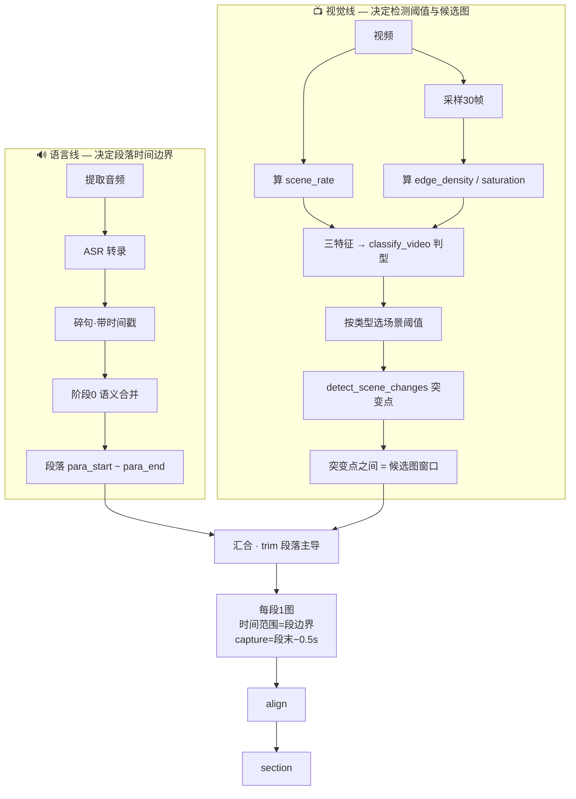

# video-to-slides 图文对齐修复 + video-type 截图策略设计

## 目标

修复 video-to-slides 图文对齐错位（截图取在段落中段而非段末），并按视频类型分流截图策略：talking_head 走「段落主导 + 段末取帧」，lecture_slides 走敏感翻页检测。不引入 VLM/视觉大模型。

## 背景：实测 bug

B站视频 BV19hwTzwETF（talking_head 讲解，815s）实测：39 页中 29 页 `section.end_ms < 段落真实 end_ms`，截图比段落真实结束平均早 5.9s。截图落在段落中段字幕（第1页截到「有人299上门帮你卸载」倒数第二句，第3页截到「让我们回到最初的起点」段落首句）。

**根因**：`align_sections`（align.py:140-142）用截图候选的 `start_ms/end_ms`（场景变化点窗口）做 section 时间范围，而非 transcript 段边界。截图候选窗口是视觉场景检测生成的，与语义段落是两套独立时间划分。

**对比调研**：videoQuickNote 按 `video_type` 分流——talking_head 用宽松阈值（threshold=35），检测到 <3 场景直接不截图。本设计借鉴此思路，复用现有 `detect_scene_changes`，不引入 scenedetect 依赖。

## 双轨架构

语言线与视觉线各自独立，在 `trim_candidates_by_transcript` 汇合，语言为主、视觉为辅。

## 设计一：video-type 判型

纯函数 `_classify_by_features(scene_rate, edge_density, saturation_mean) → VideoType`，便于单测。`classify_video(video_path)` 采样 30 帧、算特征、调纯函数。

**三特征**：
- `edge_density`：Canny 边缘像素占比。PPT 文字多 → 高；出镜人脸 → 低。
- `saturation`：HSV 的 S 通道均值。电影/动画 → 高；出镜讲解 → 低。
- `scene_rate`：全片场景变化次数 ÷ 时长。

**判型阈值表**：

| scene_rate | edge_density | saturation | 判定 |
|------------|--------------|------------|------|
| < 0.05 | > 0.15 | 任意 | lecture_slides |
| < 0.03 | < 0.10 | < 60 | talking_head |
| < 0.10 | > 0.20 | < 80 | screen_recording |
| > 0.30 | 任意 | 任意 | movie_cinematic |
| 其余 | | | tutorial（兜底） |

## 设计二：段落主导对齐（核心修复）

`trim_candidates_by_transcript` 改为：每段一张图，`start_ms/end_ms = 段边界`，`capture_ms = 段末 end_ms - capture_margin_ms`（500ms）。

- 段内有候选图 → 用该图，但时间范围写成段边界、capture 写成段末−0.5s
- 段内无候选图 + talking_head → 段末直接 `extract_frame`（不再跳过）
- 段内无候选图 + 非 talking_head → 保持原行为（不补帧，align 归并）

`detect_slides` 按 video_type 调场景阈值：talking_head=0.20（宽松，少候选），lecture_slides=0.03（敏感，翻页都检）。

## 测试策略（详细）

### 单元测试

| 测试文件 | 覆盖 | 关键断言 |
|----------|------|----------|
| `test_video_type.py::TestClassifyByFeatures` | 5 类型判型 | `_classify_by_features` 各阈值边界返回正确类型 |
| `test_video_type.py::TestSceneThresholdByType` | 阈值映射 | talking_head→0.20, lecture_slides→0.03, auto→base |
| `test_frame_selection.py::TestTrimParagraphDominant` | 段落主导截图 | slide.start/end == 段边界；capture == 段末−500；talking_head 无候选→段末取帧 |
| `test_align.py::TestParagraphDominantAlign` | 段主导对齐 | section 时间范围 == 段边界；capture == 段末−500；不落中段句 |
| `test_cli.py::TestVideoTypeArg` | 参数透传 | Settings.video_type 默认 auto；--video-type 写入 |

### 集成测试

- `test_pipeline_transcript.py::TestAutoClassifyVideo`：auto 时 capture_video 调 classify_video 并写回（monkeypatch）

### 端到端验证手册（见 specs/002 quickstart）

用新视频 BV1MAUsBME6f 端到端跑，断言段末对齐率 ≥ 90%（旧版仅 26%），抽查截图字幕落在末句。

## 卡点修复清单

| 卡点 | 修复任务 | 范围内 |
|------|----------|--------|
| 1. video-summary SKILL.md 命令路径 | 文档任务 | ✓ |
| 4. merge_procedure.md 命令路径重复 videotodoc | 文档任务 | ✓ |
| 5. 整理版缺 ## 图文讲义 标题 | 文档任务 | ✓ |
| 6. review_agent_prompt.md 归属错误 | 文档任务 | ✓ |
| 9. 图文对齐错位（核心） | trim 段落主导 | ✓ |
| 2/3. B站风控/browser_cookie3 | — | ✗（属 video-summary 下载链路，单独处理） |
| 7/8. shell 引号/grep 退出码 | — | ✗（使用技巧，非代码 bug） |

## 不做

- 不引入 VLM/视觉大模型选帧
- 不引入 scenedetect 依赖（复用现有 detect_scene_changes）
- 不改 video-summary 下载链路（B站风控另案）
